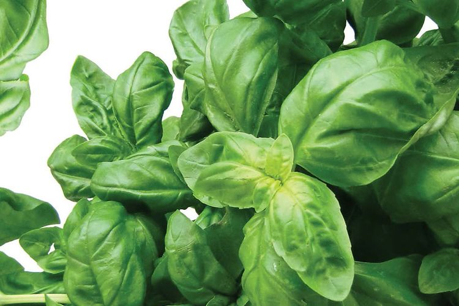

> Migrated from SteelThumb on 2026-09-27; the original body and citations are preserved below. Gardening claims and source support have not been revalidated. See the [collection index](index.md) and [attribution and license](attribution.md).

# Basil Almanac

*Close-up of Genovese basil leaves. Basil’s lush green foliage is packed with aromatic oils.*[\[1\]](https://extension.wvu.edu/lawn-gardening-pests/gardening/wv-garden-guide/growing-basil-in-west-virginia#:~:text=Basil%20is%20one%20of%20the,textures%20for%20cooking%20and%20fragrance)[\[2\]](https://gardeningsolutions.ifas.ufl.edu/plants/edibles/vegetables/basil/#:~:text=Basil%20smells%20and%20tastes%20spicy,it%20can%20be%20found%20in)

## Introduction

Basil is one of the most popular culinary herbs worldwide, prized for its fragrant leaves and versatile use in cooking[\[1\]](https://extension.wvu.edu/lawn-gardening-pests/gardening/wv-garden-guide/growing-basil-in-west-virginia#:~:text=Basil%20is%20one%20of%20the,textures%20for%20cooking%20and%20fragrance). All basil plants are part of the mint family (Lamiaceae) and belong to the genus *Ocimum*, which includes 50–150 species of annuals, perennials, and shrubs native to warm regions of Africa, Asia (especially India and Southeast Asia), and beyond[\[3\]](https://en.wikipedia.org/wiki/List_of_basil_cultivars#:~:text=perennials%20%20and%20%2045,4)[\[4\]](https://gardeningsolutions.ifas.ufl.edu/plants/edibles/vegetables/basil/#:~:text=Basil%20smells%20and%20tastes%20spicy,it%20can%20be%20found%20in). The most common type, **sweet basil** (*Ocimum basilicum*), is grown as a tender annual in most climates for its sweet, clove-like flavor that pairs especially well with tomatoes, garlic, and olive oil (hence its fame in Italian pesto)[\[5\]](https://gardeningsolutions.ifas.ufl.edu/plants/edibles/vegetables/basil/#:~:text=Sweet%20basil%20is%20commonly%20used,you%E2%80%99re%20looking%20for%20smaller%20leaves). Basil’s importance, however, is global – from Italian and Mediterranean cuisines to Thai, Vietnamese, and Indian dishes, different basil varieties bring unique flavors ranging from sweet and spicy to citrusy or licorice-like[\[4\]](https://gardeningsolutions.ifas.ufl.edu/plants/edibles/vegetables/basil/#:~:text=Basil%20smells%20and%20tastes%20spicy,it%20can%20be%20found%20in)[\[6\]](https://gardeningsolutions.ifas.ufl.edu/plants/edibles/vegetables/basil/#:~:text=Beyond%20sweet%20varieties%20there%20are,like%20sorbet%20or%20shortbread%20cookies).

In the garden, basil is a **warm-season herb** that thrives in the heat of summer and cannot tolerate frost or cold. It is typically grown for a single season (annual), although a few types are perennial in frost-free climates or when grown indoors[\[7\]](https://gardeningsolutions.ifas.ufl.edu/plants/edibles/vegetables/basil/#:~:text=Most%20basils%20are%20annuals%20in,when%20temperatures%20drop%20below%2040%C2%B0F). With the right care – providing warmth, full sun, rich soil, and regular harvesting – basil will reward the grower with continuous leafy growth. This almanac compiles comprehensive knowledge about cultivating basil: from the myriad of basil types, to propagation techniques, optimal growing conditions, maintenance tips, and how to troubleshoot common issues (pests, diseases, and environmental problems). Whether you’re aiming for a **“perpetual basil machine”** that yields fresh basil year-round or just a healthy summer herb patch, this guide covers the practical and technical know-how you need.

## Basil Varieties and Types

One of the joys of growing basil is the incredible variety available. Basil (*Ocimum* species and hybrids) comes in many forms, distinguished by leaf size, color, aroma, and flavor[\[8\]](https://en.wikipedia.org/wiki/List_of_basil_cultivars#:~:text=Basil%20cultivars%20vary%20in%20several,13)[\[9\]](https://gardeningsolutions.ifas.ufl.edu/plants/edibles/vegetables/basil/#:~:text=The%20many%20varieties%20of%20basil,leaf%2C%20and%20scented%20leaf). Most culinary basils are cultivars of *Ocimum basilicum* (sweet basil), but there are also other species and hybrids grown for specific flavors or ornamental appeal. Here are some major categories and notable varieties:

* **Sweet Green Basils:** These are the classic Italian-type basils. They have broad green leaves and a sweet, aromatic flavor (with notes of clove and anise). Examples include **Genovese basil**, the popular pesto variety with large tender leaves, and **Italian Large Leaf** basil[\[5\]](https://gardeningsolutions.ifas.ufl.edu/plants/edibles/vegetables/basil/#:~:text=Sweet%20basil%20is%20commonly%20used,you%E2%80%99re%20looking%20for%20smaller%20leaves). Plants typically grow 18–30 inches tall. There are also large-leaved types like *Lettuce Leaf basil* and *Mammoth basil* which have crinkled, oversized leaves (sometimes used in salads)[\[10\]](https://en.wikipedia.org/wiki/List_of_basil_cultivars#:~:text=clove%20%20scent%20when%20fresh.,in%20a%20bush%20form%2C%20very). *‘Nufar’* is a Genovese-type sweet basil bred for resistance to Fusarium wilt[\[11\]](https://en.wikipedia.org/wiki/List_of_basil_cultivars#:~:text=Genovese%20basil%20%20O,in%20a%20bush%20form%2C%20very). Sweet basils are the most common, but note they are also the most disease-susceptible in humid climates (more on that in the disease section).

* **Bush and Dwarf Basils:** These are compact basil varieties with small leaves, often grown in containers or as border plants. For example, **Greek Basil** (*Ocimum basilicum* var. *minimum*), sometimes called Greek “bush” or **Spicy Globe** basil, forms a small globe-shaped plant with tiny, intensely flavored leaves[\[12\]](https://en.wikipedia.org/wiki/List_of_basil_cultivars#:~:text=Nufar%20basil%20%20O,tightly%20like%20boxwood%2C%20very%20small)[\[13\]](https://en.wikipedia.org/wiki/List_of_basil_cultivars#:~:text=Osmin%20purple%20basil%20%20O,pa). They only reach \~6–10 inches in height and have a spicy, pungent taste. These types are great for decorative use and for cuisines that want a punch of flavor in a small leaf (popular in some Mediterranean dishes).

* **Purple Basils:** These varieties have striking purplish leaves, adding ornamental value and a slightly different flavor profile (often a bit more peppery or spicy). Examples: *‘Dark Opal’* (a deep purple basil, All-America Selections winner in 1962\) and *‘Purple Ruffles’* (ruffled purple leaves, AAS winner 1987\)[\[14\]](https://hgic.clemson.edu/factsheet/basil/#:~:text=%E2%80%98Purple%20Ruffles%E2%80%99%20basil%20has%20dark,leaf%20cultivars%20in%20the%20garden)[\[15\]](https://hgic.clemson.edu/factsheet/basil/#:~:text=%E2%80%98Dark%20Opal%20Purple%E2%80%99%20basil%20was,has%20more%20consistent%20purple%20coloration). Purple basils can be used similarly to green basil and make beautiful purple vinegars or garnishes[\[16\]](https://gardeningsolutions.ifas.ufl.edu/plants/edibles/vegetables/basil/#:~:text=Leaves%20can%20be%20either%20green,white%20depending%20on%20the%20variety). *‘Red Rubin’* is another magenta-purple basil similar to Dark Opal[\[17\]](https://en.wikipedia.org/wiki/List_of_basil_cultivars#:~:text=Dark%20opal%20basil%20%20O,pa). These typically grow \~18–24 inches tall.

* **Thai and Asian Basils:** **Thai Basil** (*Ocimum basilicum* var. *thyrsiflorum*) has narrow, pointed green leaves and purple stems/flower spikes. It has a distinct **licorice or anise flavor** (from the compound estragole) that is essential in many Southeast Asian dishes[\[18\]](https://en.wikipedia.org/wiki/List_of_basil_cultivars#:~:text=and%20stronger%20flavor%2C%20grown%20from,5). A common cultivar is *‘Siam Queen’*, which has purple flower heads and was a 1997 AAS award winner[\[19\]](https://hgic.clemson.edu/factsheet/basil/#:~:text=%E2%80%98Siam%20Queen%E2%80%99%20basil%20is%20a,tall%20with%20purple%20flower%20spikes). Thai basil grows about 1–2 feet tall and is more tolerant of high heat and humidity. Other related types include **Holy Basil** (*Ocimum tenuiflorum*, also called *O. sanctum* or Tulsi), used in India and Ayurvedic medicine and as a sacred herb. Holy basil has smaller leaves with a clove-like and spicy aroma and is a perennial shrub in tropical climates[\[20\]](https://en.wikipedia.org/wiki/List_of_basil_cultivars#:~:text=Clove%20Basil%20%20O,containing%20a%20strong%20portion%20of). **Cinnamon Basil** (*Ocimum basilicum* cultivar ‘Cinnamon’), sometimes called Mexican basil, has a cinnamon-like aroma (due to methyl cinnamate) and purple tinged leaves[\[21\]](https://en.wikipedia.org/wiki/List_of_basil_cultivars#:~:text=%27Siam%20Queen%27%20O,also%20sometimes%20called%20Licorice%20basil). **Licorice Basil** (a variety also known as Persian basil) similarly has anise-scented leaves[\[22\]](https://en.wikipedia.org/wiki/List_of_basil_cultivars#:~:text=Cinnamon%20basil%20%20O,Called%20%C3%A9%20in%20Vietnamese). These add interesting flavors for teas, desserts, and ethnic recipes.

* **Lemon and Lime Basils:** These are unique basil hybrids that carry a citrus fragrance due to compounds like citral and limonene[\[23\]](https://en.wikipedia.org/wiki/List_of_basil_cultivars#:~:text=Common%20name%20Species%20and%20cultivars,Columnar%20basil%2C%20can%20only%20be)[\[24\]](https://en.wikipedia.org/wiki/List_of_basil_cultivars#:~:text=Lemon%20basil%20%20O.%20americanum,24). **Lemon Basil** (*Ocimum americanum*, sometimes classified as *O. citriodorum*) has slender light green leaves with a strong lemony scent and is used in Indonesian and Thai cooking (locally called *kemangi*)[\[23\]](https://en.wikipedia.org/wiki/List_of_basil_cultivars#:~:text=Common%20name%20Species%20and%20cultivars,Columnar%20basil%2C%20can%20only%20be). **Lime Basil** is a similar type with a lime aroma[\[23\]](https://en.wikipedia.org/wiki/List_of_basil_cultivars#:~:text=Common%20name%20Species%20and%20cultivars,Columnar%20basil%2C%20can%20only%20be). They stay smaller (around 12–18 inches) and are great for fish, salads, and cocktails for a citrusy twist.

* **Variegated and Non-Flowering Basils:** A standout example is *‘Pesto Perpetuo’* (sometimes sold as **Perpetual Basil**), a variegated basil with green leaves edged in creamy white[\[25\]](https://www.desertcart.sc/products/26751663-perpetual-pesto-basil-the-best-basil-live-plant-3-pot#:~:text=The%20shape%2C%20color%2C%20and%20scent,tips%20to%20encourage%20busier%20plants). Uniquely, *Pesto Perpetuo* **does not produce flowers**, making it a “perpetual” basil that keeps producing flavorful leaves without the typical bitter turn that comes with flowering[\[25\]](https://www.desertcart.sc/products/26751663-perpetual-pesto-basil-the-best-basil-live-plant-3-pot#:~:text=The%20shape%2C%20color%2C%20and%20scent,tips%20to%20encourage%20busier%20plants)[\[26\]](https://www.desertcart.sc/products/26751663-perpetual-pesto-basil-the-best-basil-live-plant-3-pot#:~:text=Bought%20two%20plants%20last%20year%2C,are%20in%20stock%20this%20year). It has a columnar growth habit, reaching \~16–24 inches tall, and its foliage is highly ornamental[\[27\]\[28\]](https://hgic.clemson.edu/factsheet/basil/#:~:text=%E2%80%98Pesto%20Perpetuo%E2%80%99%20is%20a%20variegated,to%20approximately%2016%20inches%20tall). Gardeners love that this **sterile basil** never needs deadheading to prevent bloom – it stays in vegetative, harvestable mode all season. (It’s actually a sport of a Greek columnar basil). If you’re aiming for an endless supply of culinary basil, Pesto Perpetuo is a top choice since "you don't have to keep pinching off flowers for it to remain delicious"[\[29\]](https://www.flickr.com/photos/bodypure/464311107/#:~:text=Variegated%20Pesto%20Perpetuo%20Basil)[\[30\]](https://www.flickr.com/photos/bodypure/464311107/#:~:text=New%20to%20my%20garden%20this,sweet%20basil%20and%20greek%20basil). Another basil that seldom flowers is *‘Greek Columnar’* (often sold as *Lesbos* basil), which grows as a tall column and is propagated only from cuttings[\[31\]](https://en.wikipedia.org/wiki/List_of_basil_cultivars#:~:text=Ocimum%20%C3%97citriodorum%20cultivars%20Common%20name,name%20Species%20and%20cultivars%20Description).

* **Perennial and Specialty Basils:** Outside of the typical annual sweet basil types, there are a few perennial or shrubby basils. **African Blue Basil** (*Ocimum kilimandscharicum × basilicum*) is a sterile hybrid that is grown as a perennial ornamental; it has purple-tinged leaves with a camphor-like scent and will bloom continuously (attractive to bees) without setting seed[\[32\]](https://en.wikipedia.org/wiki/List_of_basil_cultivars#:~:text=originated%20in%20Chile.,leaved%20green). It can overwinter in mild climates or indoors since it doesn’t die after one season. There are also **Tree Basils** (like *Ocimum gratissimum*, sometimes called clove basil for its strong aroma) and other regional species used more for medicinal or spice purposes. For example, **Tulsi (Holy Basil)** mentioned above is actually a short-lived perennial in the tropics and revered for herbal tea and medicinal use rather than pesto.

Given this diversity, one can experiment with multiple basil types. For a kitchen garden, it’s common to plant several varieties: perhaps a sweet Genovese for pesto, a Thai basil for stir-fries, a lemon basil for tea or fish, and a purple basil for salads and visual interest. All basils have similar basic growing needs, but note that **disease resistance can vary by type** – e.g., the common sweet basils are very susceptible to basil downy mildew, whereas some specialty basils (Thai, lemon, purple) have **partial resistance to that disease**[\[33\]](https://gardeningsolutions.ifas.ufl.edu/plants/edibles/vegetables/basil/#:~:text=If%20downy%20mildew%20diseases%20are,found%20to%20be%20less%20susceptible)[\[34\]](https://gardeningsolutions.ifas.ufl.edu/plants/edibles/vegetables/basil/#:~:text=Unfortunately%2C%20all%20sweet%20varieties%20are,found%20to%20be%20less%20susceptible). Gardeners in mildew-prone areas might favor those types or new resistant cultivars (discussed later).

## Planting and Growing Conditions

Basil flourishes when its preferences are met. Here’s what basil needs in terms of environment and planting:

* **Timing (Season and Temperature):** Basil is **frost-sensitive** and thrives in warm weather. Plant basil outdoors only after all danger of frost has passed and night temperatures are reliably above \~50–55 °F (10–13 °C)[\[35\]](https://gardeningsolutions.ifas.ufl.edu/plants/edibles/vegetables/basil/#:~:text=Growing%20basil%20in%20raised%20beds,weed%20growth%20around%20your%20plants). In many temperate regions this means late spring. For example, in West Virginia basil is planted after the last spring frost (often late May)[\[36\]](https://extension.wvu.edu/lawn-gardening-pests/gardening/wv-garden-guide/growing-basil-in-west-virginia#:~:text=Basil%20is%20a%20tender%20annual,makes%20it%20easier%20to%20sow). If exposed to cold, basil growth will stall, and a light frost or temperatures below \~40 °F can blacken and damage the leaves[\[37\]](https://gardeningsolutions.ifas.ufl.edu/plants/edibles/vegetables/basil/#:~:text=afternoon%20shade%20to%20protect%20it,when%20temperatures%20drop%20below%2040%C2%B0F)[\[38\]](https://gardeningsolutions.ifas.ufl.edu/plants/edibles/vegetables/basil/#:~:text=leaves%20of%20many%20varieties%20will,when%20temperatures%20drop%20below%2040%C2%B0F). Basil seeds also require warmth to germinate – the soil should ideally be \~70 °F (21 °C) or warmer. In short, **basil loves heat**: it grows best in the heat of summer (80s °F / \~27–32 °C during day). In very hot climates (tropical or subtropical), basil can be grown almost year-round, though intense high temperatures might cause it to bolt (flower) faster or benefit from a bit of afternoon shade[\[7\]](https://gardeningsolutions.ifas.ufl.edu/plants/edibles/vegetables/basil/#:~:text=Most%20basils%20are%20annuals%20in,when%20temperatures%20drop%20below%2040%C2%B0F).

* **Sunlight:** Provide **full sun** for best results – at least 6–8 hours of direct sunlight daily[\[39\]](https://extension.wvu.edu/lawn-gardening-pests/gardening/wv-garden-guide/growing-basil-in-west-virginia#:~:text=Choose%20a%20location%20that%3A). Basil grown in full sun develops robust flavor (essential oil content is higher) and sturdy, well-branched plants. In extremely hot regions or mid-summer in the Deep South, plants appreciate a little break from harsh afternoon sun (light shade) to prevent leaf scorch[\[7\]](https://gardeningsolutions.ifas.ufl.edu/plants/edibles/vegetables/basil/#:~:text=Most%20basils%20are%20annuals%20in,when%20temperatures%20drop%20below%2040%C2%B0F), but generally more sun is better. If growing indoors, place basil in the sunniest window possible or use grow lights to give roughly 14–16 hours of bright light per day.

* **Soil:** Basil prefers a **fertile, well-drained soil**. An ideal soil would be a loamy garden soil rich in organic matter (like compost) so it holds moisture but still drains well. The optimal pH range is around 6.0 to 7.0 (slightly acidic to neutral)[\[40\]](https://nevegetable.org/crops/basil#:~:text=Basil%20%3A%20New%20England%20Vegetable,6.8%20is%20ideal)[\[39\]](https://extension.wvu.edu/lawn-gardening-pests/gardening/wv-garden-guide/growing-basil-in-west-virginia#:~:text=Choose%20a%20location%20that%3A), which is common in vegetable gardens. Before planting, improve poor soils by working in compost or well-rotted manure. Good drainage is important – basil’s roots do not like to sit in waterlogged conditions, as that promotes root rot. In fact, commercial growers often plant basil on raised beds or even on plastic mulch to ensure warm, well-drained soil[\[41\]](https://extension.wvu.edu/lawn-gardening-pests/gardening/wv-garden-guide/growing-basil-in-west-virginia#:~:text=Care%20and%20Maintenance). If you have heavy clay soil, consider raised beds or containers for basil.

* **Planting from Seed:** Basil can be started from seed either by **sowing indoors** or **direct-seeding** outdoors once it’s warm. The seeds are tiny (often black) and should be sown shallowly – about 1/8" to 1/4" deep in the soil[\[42\]](https://extension.wvu.edu/lawn-gardening-pests/gardening/wv-garden-guide/growing-basil-in-west-virginia#:~:text=Seed%20for%20basil%20transplants%20can,18%20inches%20between%20plants). If starting indoors, sow seeds about 4–6 weeks before your intended transplant date (which is after frost). Sow into a seed tray or pots with sterile seed-starting mix, and keep the soil warm (ideally 70–75 °F) and moist. Seeds typically germinate in \~5–10 days under warm conditions. Provide plenty of light once they sprout to avoid leggy seedlings. When seedlings have 2–3 pairs of true leaves, they can be transplanted into larger pots. **Hardening off** is important – gradually acclimate indoor-grown basil seedlings to outdoor conditions over a week or so, because sudden exposure to full sun and wind can stress or sunburn them. For direct-seeding outdoors, wait until soil is warmed (late spring); scatter seeds and cover lightly with fine soil. Thin the seedlings once they’re a couple of inches tall so that final spacing is adequate (see below).

* **Transplanting and Spacing:** Basil transplants easily. Space plants about **10 to 18 inches apart** depending on the variety’s mature size[\[42\]](https://extension.wvu.edu/lawn-gardening-pests/gardening/wv-garden-guide/growing-basil-in-west-virginia#:~:text=Seed%20for%20basil%20transplants%20can,18%20inches%20between%20plants). For common sweet basil, about 10–12 inches between plants in a row (and 18–24 inches between rows) is typical[\[43\]](https://gardeningsolutions.ifas.ufl.edu/plants/edibles/vegetables/basil/#:~:text=drainage%20and%20avoid%20having%20to,weed%20growth%20around%20your%20plants). This spacing gives each plant room to bush out and ensures good airflow (important for disease prevention). Dwarf bush basils can be closer, while very large varieties (some can reach 3 feet tall) might need a bit more space. If you bought a potted basil from the grocery store or nursery, note that those pots often contain many crowded seedlings – you can gently **divide those clumps** and plant a few clusters separately to give them space (e.g. split a pot of 12 seedlings into 3 or 4 groups)[\[44\]](https://gardening.org/propagate-basil/#:~:text=,and%20give%20them%20a%20trim). After planting basil in the garden, **mulch** around the plants (with straw, chopped leaves, etc.) to help keep the soil moist, suppress weeds, and slightly warm – but wait until the soil is thoroughly warm before mulching heavily in spring[\[41\]](https://extension.wvu.edu/lawn-gardening-pests/gardening/wv-garden-guide/growing-basil-in-west-virginia#:~:text=Care%20and%20Maintenance).

* **Container Growing:** Basil thrives in containers as long as a few requirements are met. Choose a pot at least 8–10 inches in diameter and depth for each plant (or group of a few smaller basil plants)[\[45\]](https://publications.ca.uky.edu/sites/publications.ca.uky.edu/files/NEP237.pdf#:~:text=Basil%20publications,You%20can%20also%20grow). Ensure the pot has drainage holes. Use a good quality potting mix (not heavy garden soil) so roots get both moisture and oxygen. Container basil will dry out faster than garden basil, so check soil often and water when the top inch is dry (more on watering below). Containers are great for basils because you can move them as needed (for example, indoors if an early frost threatens, extending your harvest)[\[46\]](https://extension.wvu.edu/lawn-gardening-pests/gardening/wv-garden-guide/growing-basil-in-west-virginia#:~:text=Basil%20requires%20regular%20watering%20through,be%20harvested%20throughout%20the%20fall). In fact, many gardeners keep a basil pot on a kitchen windowsill or patio for easy access and to enjoy the aroma.

* **Climate and Regional Considerations:** In tropical climates, some basils can act as perennials or self-seeding annuals. In places like Florida, basil can be planted in spring and again in fall – the heat and humidity of high summer can cause stress or disease, so mid-summer planting is sometimes avoided[\[7\]](https://gardeningsolutions.ifas.ufl.edu/plants/edibles/vegetables/basil/#:~:text=Most%20basils%20are%20annuals%20in,when%20temperatures%20drop%20below%2040%C2%B0F). Florida gardeners often treat basil as a cool-season annual (fall through spring) because of fewer disease issues in milder weather[\[7\]](https://gardeningsolutions.ifas.ufl.edu/plants/edibles/vegetables/basil/#:~:text=Most%20basils%20are%20annuals%20in,when%20temperatures%20drop%20below%2040%C2%B0F). In very arid hot climates, basil may actually prefer a bit of afternoon shade and frequent watering. Basil generally does not do well in cold or high-altitude summers – it really needs warmth. If your summers are cool, consider using black plastic mulch or planting basil in a warmer microclimate near a south-facing wall to provide extra heat[\[41\]](https://extension.wvu.edu/lawn-gardening-pests/gardening/wv-garden-guide/growing-basil-in-west-virginia#:~:text=Care%20and%20Maintenance).

In summary, **plant basil when it’s warm, in rich well-drained soil, under plenty of sun, with room to grow**. If these conditions are met, basil will establish quickly. Many gardeners pair basil with tomatoes in the garden, as they have similar needs (warmth, sun, fertile soil), and folklore even suggests basil can help repel some tomato pests[\[47\]](https://extension.wvu.edu/lawn-gardening-pests/gardening/wv-garden-guide/growing-basil-in-west-virginia#:~:text=Helpful%20Tip%21%20%20Basil%20can,insects%20which%20may%20damage%20tomatoes) – at the very least, they taste great together\! Basil can also be interplanted with peppers or grown along garden edges. Once planted, basil grows fast – you can expect to start harvesting leaves within 4–6 weeks of sowing if the weather is favorable.

## Propagation: Seeds, Cuttings, and Continuous Basil Supply

While growing from seed is common, basil is also one of the **easiest herbs to propagate from cuttings**, which is excellent for multiplying your plants or maintaining a continuous supply. Let’s cover both methods:

**Growing Basil from Seed:** Starting basil from seed is straightforward and cost-effective, allowing you to access many varieties.

* **Sowing:** As mentioned, sow indoors 1/4 inch deep in trays or pots about 4–6 weeks before last frost, or directly outdoors when warm[\[42\]](https://extension.wvu.edu/lawn-gardening-pests/gardening/wv-garden-guide/growing-basil-in-west-virginia#:~:text=Seed%20for%20basil%20transplants%20can,18%20inches%20between%20plants). Sow a few seeds per cell or spot (they germinate well, typically over 80% in fresh seed). Because seeds are small, you can mix them with a bit of sand to sprinkle, for even distribution. Gently mist or bottom-water to avoid displacing seeds.

* **Germination and Seedling Care:** Basil seeds usually sprout within 5–7 days if kept at \~70 °F and consistently moist. Provide bright light as soon as they sprout to prevent them from getting leggy. A sunny window might suffice, but ideally use fluorescent or LED grow lights a few inches above the seedlings for 14 hours a day. Keep seedlings lightly moist – never waterlogged (to avoid damping off disease)[\[48\]](https://ipm.ucanr.edu/home-and-landscape/basil/#:~:text=,Fusarium%20wilt). Good air circulation helps too. Thin the seedlings: if multiple came up together, trim or gently separate them so each plant has its own space to grow sturdy. Basil seedlings can be fed a very diluted fertilizer once they have a couple sets of true leaves, but if in a nutrient-rich potting mix, it may not be necessary.

* **Transplanting:** When seedlings are \~3–4 inches tall and have at least 2–3 pairs of true leaves, they can be transplanted. Handle basil gently by the leaves or root ball (their stems can bruise easily). Plant them at the same depth they were in the pot. After transplanting to the garden (with proper hardening off), ensure they’re well-watered initially. Within a couple of weeks, they’ll begin vigorous outdoor growth.

* **Succession Planting:** To keep basil coming, you might sow seeds again in mid-summer, especially if earlier plants are starting to weaken or flower. Alternatively, use cuttings from the first plants to create new ones (see below). Regular sowings or propagation will give a **perpetual harvest** even as individual plants age.

**Propagating Basil from Cuttings:** Basil is a *cooperative* herb when it comes to cuttings – it roots quickly and easily[\[49\]](https://gardening.org/propagate-basil/#:~:text=Basil%20is%20a%20cooperative%20herb,new%20to%20the%20propagating%20game). This is a fantastic way to clone a favorite basil (ensuring the new plant is identical to the parent, which is important for hybrids or sterile types) and to produce new plants for free. Here’s how:

* **Taking a Cutting:** Select a healthy basil plant and cut a non-flowering stem about 4 inches long[\[50\]](https://gardening.org/propagate-basil/#:~:text=1,water%20or%20in%20another%20medium). Cut **just below a leaf node** (the point where a leaf pair attaches), because that’s where rooting hormones are concentrated. Use clean scissors or pruners. Remove the leaves from the lower 2 inches of the cutting, so that no leaves will be submerged (they can rot)[\[50\]](https://gardening.org/propagate-basil/#:~:text=1,water%20or%20in%20another%20medium). You can leave a couple of small leaves at the top; if they are large leaves, it can help to cut them in half to reduce evaporation stress on the cutting.

* **Water rooting method:** Place the prepared cutting in a clear container of water so that the bottom 2 inches of stem are submerged[\[51\]](https://gardening.org/propagate-basil/#:~:text=If%20rooting%20in%20water%3A). Make sure no leaves are in the water, only the stem. If your tap water is chlorinated, let it sit out 24 hours first or use filtered water – basil can be sensitive to chlorine[\[52\]](https://gardening.org/propagate-basil/#:~:text=,water%20is%20not%20heavily%20chlorinated). Keep the cutting in a warm, bright spot but *out of direct scorching sun*. A windowsill with indirect light or a spot under grow lights is fine. Change the water every few days to keep it oxygenated and prevent stagnation[\[53\]](https://gardening.org/propagate-basil/#:~:text=,white%20roots%20an%20inch%20long). Within as soon as 7–10 days, you should see roots emerging from the stem (it can take up to 2–3 weeks for slower varieties or cooler conditions)[\[53\]](https://gardening.org/propagate-basil/#:~:text=,white%20roots%20an%20inch%20long). Let the roots grow to about an inch or two long, then the cutting is ready to pot up.

* **Soil/medium rooting method:** Alternatively, you can root basil cuttings directly in a pot with a moist growing medium (such as seed starting mix, vermiculite, or even sand). Dip the cut end in rooting hormone powder or gel if you have it (not strictly necessary as basil roots readily, but can speed things up)[\[54\]](https://gardening.org/propagate-basil/#:~:text=the%20top%20one%20or%20two,water%20or%20in%20another%20medium). Stick the cutting into a small hole in the pre-moistened medium and gently firm the soil around it[\[55\]](https://gardening.org/propagate-basil/#:~:text=,indirect%20light%20in%20the%20summer). Keep high humidity around the cutting – mist it and/or cover the pot loosely with a plastic dome or bag to reduce moisture loss[\[56\]](https://gardening.org/propagate-basil/#:~:text=Tip%3A%20Misting%20the%20leaves%20and,water%20while%20growing%20new%20roots). Place in bright, indirect light. In 2–3 weeks, test for rooting by *very gently* tugging on the cutting; if you feel resistance, roots have formed[\[57\]](https://gardening.org/propagate-basil/#:~:text=%2A%20In%202,not%20to%20pull%20it%20out). (Avoid pulling it out vigorously, as young roots are delicate.)

* **Transplanting cuttings:** Cuttings rooted in water can be transplanted to soil once they have a nice cluster of roots \~1–2 inches long. Be careful, as water-grown roots are somewhat fragile; pot it up and keep it well-watered as it adjusts. Cuttings rooted in media can simply continue growing in that pot or be transplanted to a larger container or the garden. To ease the transition, keep newly potted cuttings in partial shade for a couple days and make sure they don’t dry out. Soon they will resume new top growth.

By using cuttings, you can effectively **leapfrog the seedling stage** – a cutting taken from a mature plant is already an “adult” and will grow and branch quickly. This is especially useful late in the season: for example, before cold weather kills your basil, take cuttings and root them indoors to have a head-start on basil for the next season, or to keep a living supply going indoors over winter. Gardeners aiming for a *perpetual basil supply* often do exactly this: continuously propagate new plants from cuttings of the best performers[\[58\]](https://gardening.org/propagate-basil/#:~:text=Prune%20your%20basil%20to%20keep,keep%20you%20in%20basil%20indefinitely)[\[59\]](https://gardening.org/propagate-basil/#:~:text=1,to%20form%2C%20if%20not%20before). It’s a cycle: grow one plant to a decent size, take a few cuttings and root them, and as the older plant eventually flowers or loses vigor, its “offspring” are ready to take over producing fresh leaves. This method, combined with staggering seed sowings, can truly give you basil year-round with a bit of planning.

**Dividing supermarket basil:** Another propagation trick: those bushy basil plants sold in grocery stores (usually in little pots) often contain a dozen or more seedlings crowded together[\[44\]](https://gardening.org/propagate-basil/#:~:text=,and%20give%20them%20a%20trim). You can carefully separate these to get many individual basil plants. Gently remove the root ball from the pot, soak it in water or tease apart the roots to split into smaller clumps or single plants[\[44\]](https://gardening.org/propagate-basil/#:~:text=,and%20give%20them%20a%20trim). Don’t worry if a few roots break – basil is tough. Pot each up or plant out with adequate spacing. Give them a trim (since roots were disturbed, trimming leaves reduces stress)[\[60\]](https://gardening.org/propagate-basil/#:~:text=,and%20give%20them%20a%20trim). Within a week or two, they’ll recover and start growing into proper, bushier basil plants that you can continue to nurture (far extending the life of what otherwise might have been a one-time use plant).

In summary, basil can be propagated by **seeds for genetic variety or volume**, and by **cuttings for speed and cloning specific varieties**. Both are easy and rewarding. Through propagation techniques, a single basil plant can lead to dozens more over a season, which is excellent news for pesto lovers\! And if your goal is a *“basil machine”* that never runs out, remember to keep a few cuttings going or new seeds germinating every few weeks during the growing season. Basil grows so fast that with overlapping plantings, you’ll always have some at peak production while others are just starting or finishing.

## Basil Plant Care and Maintenance

Once your basil is planted and growing, a bit of ongoing care will keep it healthy and maximized for leaf production. Here are the key practices for basil maintenance:

* **Watering:** Consistent moisture is important for basil. Basil likes its soil **evenly moist but not waterlogged**[\[61\]](https://gardening.org/propagate-basil/#:~:text=2,better%20than%20many%20shallow%20waterings). In the ground, this usually means watering deeply whenever the top inch or so of soil has dried out. In hot weather, that might be a thorough watering 2–3 times a week (or more in drought), whereas in cooler or humid conditions it might be weekly. In containers, check daily since pots can dry out quickly in sun. Basil will **wilt** visibly when it gets too dry, and while it usually perks up after watering, drought stress can cause it to flower early or reduce its leaf aroma. Aim to water before you see serious wilting. However, avoid overwatering – soggy soil promotes root rot. A good approach is to water in the morning at the base of the plant (to keep leaves dry) until the soil is moist to about 6–8 inches deep. **Mulching** around basil with straw or compost can help retain soil moisture so it doesn’t dry out as fast. Remember, a few deep waterings are better than many light sprinkles; you want to encourage roots to grow downward. Basil does *not* like to dry out like some Mediterranean herbs do[\[61\]](https://gardening.org/propagate-basil/#:~:text=2,better%20than%20many%20shallow%20waterings) – treat it a bit more like a leafy vegetable in terms of water needs.

* **Fertilizing:** Basil is a leafy, fast-growing herb, so it appreciates some nutrients, especially nitrogen, for continual growth. If you plant basil in rich soil with compost, often no additional fertilizer is needed during the season[\[62\]](https://gardening.org/propagate-basil/#:~:text=day%2C%20you%20may%20need%20to,increase%20your%20watering%20frequency). In less fertile soil or in pots (where nutrients leach out with watering), feeding is beneficial. Use a **balanced, general-purpose fertilizer** (for example 10-10-10 or an organic equivalent) at a **mild rate**. Too much fertilizer, particularly too much nitrogen, can cause very lush growth that may be a bit less flavorful or more susceptible to disease – so don’t overdo it. A light application of a granular organic fertilizer at planting time, and perhaps a mid-season side-dress, is sufficient. For containers, a diluted liquid fertilizer (like fish emulsion or compost tea) every 3-4 weeks keeps plants productive. Be cautious not to get fertilizers on the leaves (rinse if you do) since you’ll be eating them[\[63\]](https://gardening.org/propagate-basil/#:~:text=If%20grown%20in%20a%20container%2C,you%20are%20going%20to%20eat). Basil also appreciates **soil with calcium and magnesium** (these help build aromatic oils) – if your soil is very acidic, a little lime can help with calcium; if you notice interveinal yellowing on older leaves, it could be magnesium deficiency (in containers especially) which can be fixed with a bit of Epsom salt in water[\[64\]](https://www.e-gro.org/pdf/E303.pdf#:~:text=Basil%20www.e,yellowing). In general, keep basil **well-fed but not excessively** – moderate fertility yields the best flavor.

* **Pruning & Pinching (Preventing Flowers):** This is *critical* for a long harvest. Basil is programmed to flower (bolt) once it reaches maturity, which usually happens quickly in warm weather unless we intervene. **Regular pinching or pruning of the stems** delays flowering and encourages the plant to become bushy and dense with foliage[\[65\]](https://extension.wvu.edu/lawn-gardening-pests/gardening/wv-garden-guide/growing-basil-in-west-virginia#:~:text=To%20harvest%20basil%2C%20clip%20or,blooms%2C%20the%20plant%20stops%20producing)[\[59\]](https://gardening.org/propagate-basil/#:~:text=1,to%20form%2C%20if%20not%20before). A good rule: once a stem has 4 to 6 pairs of leaves, pinch off the top set (the growing tip). This not only gives you leaves to use, but stimulates the two axillary buds below that pinch to grow into new branches, effectively doubling the number of growing tips[\[59\]](https://gardening.org/propagate-basil/#:~:text=1,to%20form%2C%20if%20not%20before)[\[66\]](https://gardening.org/propagate-basil/#:~:text=,cuttings%20to%20start%20new%20plants). Repeat this every week or two throughout the season. Essentially, **never let the basil flower** (unless you intentionally want seeds at the end). If you see a flower bud forming at the tip (you’ll notice a little cone or spike of small white/purple flowers), cut it off immediately. The reason: once basil flowers, the plant shifts energy from leaf growth to flowering/seed production, and the existing leaves can turn bitter or tough[\[67\]](https://extension.wvu.edu/lawn-gardening-pests/gardening/wv-garden-guide/growing-basil-in-west-virginia#:~:text=transplanted%20to%20grow%20a%20new,will%20produce%20volunteer%20basil%20plants)[\[68\]](https://gardeningsolutions.ifas.ufl.edu/plants/edibles/vegetables/basil/#:~:text=branching%20and%20the%20production%20of,new%20leaves). By keeping flowers at bay, you prolong the vegetative (leafy) phase indefinitely. Pruning also keeps the plant in a nice mounded shape rather than tall and lanky. During peak summer, you might need to prune (harvest) each basil plant every 1–2 weeks[\[69\]](https://gardening.org/propagate-basil/#:~:text=Pruning%20will%20also%20encourage%20basil,woody%20plant%20with%20smaller%20leaves). Don’t be afraid to cut – basil actually grows more vigorously after a good trim. Just remember when cutting: prune **above** a pair of leaves (leave at least 4 leaves on the remaining stem) so that regrowth can occur[\[70\]](https://extension.wvu.edu/lawn-gardening-pests/gardening/wv-garden-guide/growing-basil-in-west-virginia#:~:text=Harvesting%20Basil). Also, use clean scissors for a clean cut and to prevent disease spread. The cut-off tops, of course, are usable – that’s your harvest\! This regular harvesting is a win-win: you get continual basil for the kitchen, and the plant stays in peak production mode.

* **Harvesting Technique:** In addition to pinching tips, you can harvest by snipping individual leaves as needed for a recipe, but often it’s better to take the opportunity to pinch stems as described. When harvesting a larger quantity (say to make pesto), avoid stripping all leaves from any one plant. Instead, cut several stems back, leaving some foliage on each so the plant can regrow[\[71\]](https://hgic.clemson.edu/factsheet/basil/#:~:text=Basil%20leaves%20may%20be%20harvested,store%20long%2C%20even%20under%20refrigeration). A common method is to clip the top 4–6 inches off multiple branches, which yields a lot of tender growth and also prunes the plant. Harvest in the morning if possible, when leaves are most hydrated and flavorful (and not limp from midday sun)[\[72\]](https://extension.wvu.edu/lawn-gardening-pests/gardening/wv-garden-guide/growing-basil-in-west-virginia#:~:text=Basil%20should%20be%20harvested%20while,frozen%20if%20not%20used%20fresh). Basil leaves bruise easily, so handle them gently; use them fresh or store properly (see Harvest & Storage section).

* **Weeding and Mulching:** Keep the area around basil free of weeds, which compete for nutrients and can harbor pests. A layer of organic mulch (straw, wood chips, compost) around the plants will suppress weeds and maintain soil moisture and temperature, benefitting basil[\[41\]](https://extension.wvu.edu/lawn-gardening-pests/gardening/wv-garden-guide/growing-basil-in-west-virginia#:~:text=Care%20and%20Maintenance). Just keep mulch a tiny bit back from the plant stem to prevent excess moisture right at the base.

* **Staking (if needed):** Most basil plants don’t require staking, but some can get top-heavy when large or if they manage to flower (flower stalks can make them flop). Also, high winds can occasionally snap a big basil stem. If you have a 2–3 foot tall variety, you might stake it loosely or plant it in a somewhat sheltered spot. In general, compact growth from pruning keeps stems sturdy.

* **Indoor Basil Care:** If you grow basil indoors (either year-round or bringing outdoor plants inside for winter), give it as much light as possible. Basil will need strong grow lights in winter to really thrive – a sunny window alone (with short daylight) often yields spindly growth. Watch out for indoor-specific pests like aphids, whiteflies, or spider mites (check under leaves regularly). Good airflow (a small fan) helps prevent fungal issues in the more stagnant indoor environment. Also, indoor basil prefers temperatures above \~65 °F; don’t let it sit in cold drafts near windows in winter. Water indoor basil when the top 1/2 inch of potting mix is dry – indoor pots might not dry as fast as outdoors, so be careful not to overwater. If you notice your indoor basil struggling after several months, don’t be discouraged – you can always start a new batch from cuttings or seed since basil grows quickly.

* **Perennial Basil Care:** In climates where certain basils behave as perennials (e.g., holy basil, African blue basil, or even sweet basil in the tropics), the plants can become woody over time. They may benefit from a hard pruning once a year to refresh growth. For example, a holy basil shrub can be cut back by half to encourage tender new shoots. Always keep some green growth on the plant when pruning hard, and do it at a time when the plant can rebound (warm weather, adequate rain). Even perennials might decline after 2–3 years and need repropagation.

* **“Perpetual Basil Machine” Approach:** Combining the above care tips with propagation can yield an endless cycle. As one gardener humorously noted, pruned basil stems can be used to start new cuttings to **“keep you in basil indefinitely”**[\[59\]](https://gardening.org/propagate-basil/#:~:text=1,to%20form%2C%20if%20not%20before). One strategy: towards end of summer, take cuttings of your best basil plants and root them indoors. Grow them under lights through fall and winter as a small indoor supply. In late winter, start new seeds as well. Come spring, you have a mix of new and cloned basil ready to go outside after frost. This way you are never without some basil. Some newer varieties like *‘Amazel’* (a branded type) are both sterile (no flowers) and disease-resistant, bred to live longer and yield continuously – if you come across those, they are practically designed for perpetual harvest in a pot. But even with regular basils, the key is diligent pruning and timely propagation. With planning, it’s entirely possible to have fresh basil 12 months a year – essentially a *rotating basil farm* in your home and garden.

In essence, basil care boils down to: **give me sun, feed me a bit, don’t let me dry out, and please keep cutting me so I don’t turn into a flower factory\!** Basil tends to “tell” you what it needs through its appearance: wilting \= needs water; pale lower leaves \= possibly hungry for nitrogen; stretching tall with flower buds \= begging to be pruned. Pay attention to those signals and you’ll be rewarded with lush growth.

## Common Basil Pests and How to Manage Them

While basil’s aromatic oils can deter some pests, it is by no means pest-free. Various insects (and some mollusks and animals) may attack basil. Here we outline the most common pests and how to address them in an edible garden setting:

* **Aphids:** These are small soft-bodied insects (often green, but can be black, gray, or other colors) that cluster on new growth and the undersides of leaves. They suck plant sap, causing leaves to curl, distort, or yellow. You might notice sticky “honeydew” (their sugary excrement) on leaves which can lead to sooty mold. Aphids are common on many garden plants, including basil, especially in lush, nitrogen-rich growth. *Control:* First, try **non-chemical** approaches: spray them off with a strong jet of water from a hose[\[73\]](https://extension.umaine.edu/gardening/2023/07/19/what-could-be-eating-my-basil-seedlings/#:~:text=the%20Clemson%20resource%2C%20but%20first,toxicity%20insecticidal%20soap) (this often knocks populations down significantly). Check daily and squish any colonies with your fingers or a cloth. Encourage natural predators like ladybugs and lacewings. If infestation persists, use an **insecticidal soap** spray – these fatty-acid soaps are effective on aphids by disrupting their cell membranes on contact[\[73\]](https://extension.umaine.edu/gardening/2023/07/19/what-could-be-eating-my-basil-seedlings/#:~:text=the%20Clemson%20resource%2C%20but%20first,toxicity%20insecticidal%20soap)[\[74\]](https://hgic.clemson.edu/factsheet/basil/#:~:text=Aphids%2C%20spider%20mites%2C%20whiteflies%20and,an%20insecticidal%20soap%2C%20such%20as). Make sure to spray undersides of leaves where aphids hide[\[75\]](https://hgic.clemson.edu/factsheet/basil/#:~:text=,Insect%20Killer%20Concentrate). Repeat every few days as needed. Neem oil or products with azadirachtin (a natural insect growth inhibitor) can also help against aphids[\[76\]](https://hgic.clemson.edu/factsheet/basil/#:~:text=Alternatively%2C%20basil%20may%20be%20sprayed,thrips%2C%20spider%20mites%20and%20whiteflies). Because you’ll eat the basil, avoid harsh chemical insecticides; luckily aphids are usually controllable with the gentle methods above.

* **Japanese Beetles:** In regions where Japanese beetles are present, basil is one of their favored snacks. These beetles are a shiny metallic green and copper color and about 1/2 inch long. They emerge in early to mid-summer and voraciously feed on foliage, often causing a **“skeletonizing”** damage – they eat the leaf tissue but leave the veins, so you get a lace-like leaf remnant[\[77\]](https://hgic.clemson.edu/factsheet/basil/#:~:text=The%20most%20common%20pests%20of,or%20dropped%20into%20soapy%20water). They can decimate a basil patch in days if in large numbers. *Control:* Hand-picking is effective for small plantings: in early morning or evening when they’re slower, flick or pluck the beetles into a jar of soapy water to drown them[\[78\]](https://extension.umaine.edu/gardening/2023/07/19/what-could-be-eating-my-basil-seedlings/#:~:text=Japanese%20beetle%20,to%20higher%20location%2C%20and%20aphids)[\[77\]](https://hgic.clemson.edu/factsheet/basil/#:~:text=The%20most%20common%20pests%20of,or%20dropped%20into%20soapy%20water). Japanese beetle traps exist but use them cautiously (place them far from your garden, as they attract beetles). You can also protect basil during peak beetle time with a fine mesh or floating row cover (remove during the day if bees need to pollinate nearby plants, though basil itself doesn’t need pollination for leaf harvest)[\[79\]](https://extension.umaine.edu/gardening/2023/07/19/what-could-be-eating-my-basil-seedlings/#:~:text=the%20Clemson%20resource%2C%20but%20first,to%20higher%20location%2C%20and%20aphids). Some organic pesticides like neem or spinosad can deter/kill beetles, but with edible basil, physical removal is often preferred. Fortunately, Japanese beetle season only lasts a few weeks in mid-summer in many areas[\[77\]](https://hgic.clemson.edu/factsheet/basil/#:~:text=The%20most%20common%20pests%20of,or%20dropped%20into%20soapy%20water), after which pressure eases.

* **Slugs and Snails:** Slimy mollusks may not come immediately to mind with herbs, but slugs (and their shelled cousins, snails) will certainly munch basil, especially tender young plants. They chew irregular holes in leaves, often larger chunks missing from edges, and feed at night or on rainy days. You might see their silvery slime trails on the pot or soil as a clue. Mulched garden beds can harbor slugs since they like hiding in the cool damp mulch by day[\[80\]](https://hgic.clemson.edu/factsheet/basil/#:~:text=including%20aphids%2C%20beetles%2C%20thrips%2C%20spider,mites%20and%20whiteflies). *Control:* **Hand pick** slugs at night with a flashlight (drop them in soapy water). **Traps** like a shallow dish of beer sunk in the soil can lure and drown them. You can also sprinkle **diatomaceous earth** (DE) around the base of plants – DE is abrasive to slugs’ bodies and can deter them[\[80\]](https://hgic.clemson.edu/factsheet/basil/#:~:text=including%20aphids%2C%20beetles%2C%20thrips%2C%20spider,mites%20and%20whiteflies), but reapply after rain. A more long-term solution is iron phosphate-based organic slug baits (e.g., products like Sluggo) which are pellets the slugs eat and then stop feeding[\[81\]](https://hgic.clemson.edu/factsheet/basil/#:~:text=Newer%2C%20safer%20slug%20baits%20are,iron%20phosphate%2C%20such%20as%20in)[\[82\]](https://hgic.clemson.edu/factsheet/basil/#:~:text=Iron%20phosphate%20will%20stop%20feeding,kill%20cutworms%2C%20ants%2C%20and%20earwigs). Iron phosphate is not harmful to pets/wildlife (unlike older metaldehyde baits)[\[83\]](https://hgic.clemson.edu/factsheet/basil/#:~:text=,also%20contains%20spinosad), and it works slowly but effectively. Scatter those around basil if slug damage is serious. Also, removing excess mulch or debris can reduce slug habitat. If your basil is in a pot, putting copper tape around the pot can repel slugs (they don’t like crawling on copper due to a reaction with their slime). Another tip: elevate pots or use a drip tray with water moat to isolate plants from slugs.

* **Spider Mites:** These tiny arachnids are a common pest on indoor plants and in hot, dry outdoor conditions. They are less than 1 mm in size and often red or yellowish. They suck plant juices like aphids do, usually on the undersides of leaves, causing a stippled, speckled yellowing. If infestation is heavy, you may see fine webbing on the plant (hence the name spider mite). Basil can get spider mites especially in greenhouse or indoor setups that are warm and dry. *Control:* Increase **humidity** – mites hate moisture. Mist the basil or even give it a gentle shower (shield the soil). Outdoors, they often multiply during drought, so keeping plants well-watered can deter them. Predatory mites and ladybugs eat spider mites if you want a biocontrol route. Otherwise, insecticidal soap or neem oil spray will kill mites on contact[\[74\]](https://hgic.clemson.edu/factsheet/basil/#:~:text=Aphids%2C%20spider%20mites%2C%20whiteflies%20and,an%20insecticidal%20soap%2C%20such%20as)[\[76\]](https://hgic.clemson.edu/factsheet/basil/#:~:text=Alternatively%2C%20basil%20may%20be%20sprayed,thrips%2C%20spider%20mites%20and%20whiteflies); you’ll need to hit the undersides of leaves thoroughly. Repeat treatments every few days for a couple of weeks, as mites breed quickly. Always apply in cooler times of day because soap or oils on leaves under hot sun can cause phytotoxicity. Indoors, wiping leaves with a damp cloth periodically can keep numbers down.

* **Whiteflies:** Tiny white winged insects often found in swarms that flutter up when the plant is disturbed. They are related to aphids and also suck sap from the undersides of leaves. Whiteflies are more frequently an issue in greenhouse or indoor herb growing, but outdoors they can appear in warm regions or where there’s overcrowding. They cause leaves to yellow and can produce sticky honeydew like aphids do. *Control:* **Yellow sticky traps** are very effective – whiteflies are attracted to yellow and will get stuck on the trap, helping monitor and reduce populations. As with aphids and mites, insecticidal soap is a good low-toxicity option; it must contact the insects directly[\[74\]](https://hgic.clemson.edu/factsheet/basil/#:~:text=Aphids%2C%20spider%20mites%2C%20whiteflies%20and,an%20insecticidal%20soap%2C%20such%20as). Repeated sprays (every 5–7 days) may be needed to catch newly hatching ones. Introducing tiny parasitic wasps (Encarsia formosa) is a greenhouse solution (they parasitize whitefly nymphs), but in a small home setup, usually simple measures suffice. Keeping basil well-ventilated and not too densely packed helps, as stagnant humid air encourages whiteflies. Check new plants you bring in for whitefly eggs or nymphs (look under leaves for tiny oval scales).

* **Flea Beetles:** These are very small, shiny black or bronze beetles that jump like fleas when disturbed. They chew numerous tiny round holes in leaves, making a “shotgun” pattern of damage. Young basil seedlings are particularly vulnerable to heavy flea beetle feeding, which can stunt or kill them if the leaf area gets too destroyed. Flea beetles are often worse in areas with lots of brassicas or weeds they like. *Control:* Floating **row covers** can physically exclude flea beetles, at least until plants are larger and more resilient. Keep the area **weed-free**, as many species breed on weeds in the mustard family and then move to herbs/vegetables[\[84\]](https://ipm.ucanr.edu/home-and-landscape/basil/#:~:text=). In small gardens, hand disturbance (shaking plants so beetles hop off) and sticky traps can catch some. There are organic pesticides like spinosad that are effective against flea beetles, but they should be a last resort on herbs. Often flea beetle damage looks worse than it is – basil can grow through moderate holey damage. Protect the youngest plants, and later on, a healthy basil can tolerate some flea nibbles.

* **Caterpillars (e.g., Armyworms, Loopers):** Various caterpillars (the larvae of moths or butterflies) might take a liking to basil. Armyworms and cutworms, for instance, are noted as occasional pests of basil[\[85\]](https://ipm.ucanr.edu/home-and-landscape/basil/#:~:text=,26). They will chew sizable chunks or entire leaves. If you see frass (poop pellets) or large bites, inspect the plant at night or early morning for fat caterpillars. *Control:* Handpick and remove them – caterpillars are usually few in number on herbs. If an armyworm infestation is severe (more common in crop fields than home gardens), an organic BT (Bacillus thuringiensis) spray can be used; it’s a biological that specifically kills caterpillars that ingest it. But in most home cases, just pluck the “worm” off and relocate or dispose of it. **Cutworms**, which are caterpillars that hide in soil and cut seedlings at the base, can be thwarted by collars (a ring of cardboard or plastic around the seedling stem pressed into the soil a bit). Once basil stems are thicker, cutworms aren’t an issue.

* **Leaf Miners:** While not commonly noted on basil, some leaf-mining fly larvae might occasionally tunnel within basil leaves (leaving whitish squiggly trails). The best fix is simply to pinch off and discard (trash) affected leaves. This prevents the larvae from maturing and emerging.

* **Nematodes:** In certain areas, **root-knot nematodes** (microscopic roundworms that live in soil) can infest basil roots, causing swollen galls on roots and stunted, yellowing plants[\[85\]](https://ipm.ucanr.edu/home-and-landscape/basil/#:~:text=,26). This is more common in sandy, warm soils (e.g., parts of the Southeast US). If your basil consistently grows poorly and you see knobby roots when pulling it up, nematodes could be the cause. *Control:* Use **crop rotation** – don’t plant basil or related crops in that spot for a few years (nematode eggs persist in soil). Solarizing the soil (covering with clear plastic in the sun for a few weeks) can reduce nematode populations by heating the soil. In nematode-infested areas, you might have better luck growing basil in raised beds with fresh soil or in containers. Also, marigolds as companion plants can suppress some nematodes if planted densely and tilled in (they release compounds toxic to nematodes).

* **Animals:** Although many critters avoid aromatic herbs, sometimes rabbits, deer, or groundhogs may nibble on basil (especially if they are hungry and the basil is lush). If you find plants chomped off without insect damage signs, consider wildlife. *Control:* Use fencing or netting if these animals are an issue. Potted basil can be moved to safety if needed. Birds generally don’t eat basil leaves, though occasionally one might taste; more often birds are beneficial, picking off insects on the plants.

In managing pests on an edible like basil, **manual and organic controls are preferred**, to keep the crop safe to eat. Always wash basil leaves thoroughly before using, especially if you’ve applied any sprays (even soaps or oils). Fortunately, basil grows quickly, so even if pests cause some damage, with a bit of care the plant often rebounds with new growth. Maintaining plant health through proper watering and nutrition is the first defense – a vigorous plant can better withstand pests or outgrow the damage. Regularly inspect your basil (especially the undersides of leaves and growing tips) so you catch any pest problem early, when it’s easiest to control. Basil’s fragrance might not ward off everything, but it does mean we usually smell problems (or see their effects) in time to act\!

## Basil Diseases and How to Prevent/Treat Them

Basil can be prone to a few diseases, particularly in warm and humid conditions. Proper cultural practices can prevent many issues. Below are the most common diseases that afflict basil, along with identification and management tips:

* **Basil Downy Mildew (BDM):** *Peronospora belbahrii* is the pathogen behind this notorious disease. First reported in the U.S. in 2007 (Florida), basil downy mildew has since become the most damaging basil disease across many regions[\[86\]](https://www.vegetables.cornell.edu/pest-management/disease-factsheets/basil-downy-mildew/#:~:text=Downy%20mildew%20has%20been%20the,has%20caused%20complete%20crop%20loss). It **spreads rapidly** and can cause complete crop loss in a matter of weeks if unchecked[\[87\]](https://extension.umn.edu/disease-management/basil-downy-mildew#:~:text=Quick%20facts)[\[88\]](https://www.vegetables.cornell.edu/pest-management/disease-factsheets/basil-downy-mildew/#:~:text=Downy%20mildew%20has%20been%20the,with%20any%20symptoms%20are%20rendered). **Symptoms:** The earliest sign is a diffuse **yellowing on the top of leaves**, often in sections between major veins (giving a somewhat patchy or angular yellow pattern)[\[89\]](https://hgic.clemson.edu/factsheet/basil/#:~:text=Initially%2C%20the%20symptoms%20of%20downy,will%20drop%20from%20the%20plant)[\[90\]](https://www.vegetables.cornell.edu/pest-management/disease-factsheets/basil-downy-mildew/#:~:text=Symptoms%20and%20Signs). It can look like the plant is nutrient deficient or sun-scalded at first[\[89\]](https://hgic.clemson.edu/factsheet/basil/#:~:text=Initially%2C%20the%20symptoms%20of%20downy,will%20drop%20from%20the%20plant)[\[91\]](https://www.vegetables.cornell.edu/pest-management/disease-factsheets/basil-downy-mildew/#:~:text=The%20first%20step%20in%20preparing,can%20be%20placed%20upside%20down). Soon after, if you flip the leaf over, you’ll see the telltale **grayish-purple fuzzy spores** on the underside of the yellowed areas[\[92\]](https://extension.umn.edu/disease-management/basil-downy-mildew#:~:text=pale%20yellow%20areas%20on%20the,to%20prevent%20basil%20downy%20mildew)[\[93\]](https://hgic.clemson.edu/factsheet/basil/#:~:text=brown%20spots%20begin%20to%20develop,will%20drop%20from%20the%20plant). Those are the sporangia of the downy mildew. In humid conditions, you might even see this “downy” growth on undersides without much yellowing yet. As it progresses, the affected leaves turn brown or black and die[\[94\]](https://extension.umn.edu/disease-management/basil-downy-mildew#:~:text=,lower%20surface%20of%20the%20leaf)[\[95\]](https://emgv.ces.ncsu.edu/2022/07/why-are-the-leaves-of-my-basil-turning-yellow/#:~:text=Once%20a%20BDM%20spore%20lands,death%20of%20the%20entire%20plant), often dropping from the plant. The disease usually starts on lower leaves and moves upward[\[96\]](https://extension.umn.edu/disease-management/basil-downy-mildew#:~:text=,lower%20surface%20of%20the%20leaf). It *loves* warm (60–80 °F) and humid environments – outbreaks often worsen in late summer when nights are warm and dew periods are long[\[97\]](https://extension.umn.edu/disease-management/basil-downy-mildew#:~:text=,is%20often%20in%20late%20summer). Downy mildew is **airborne** (spores travel on the wind for long distances) and can also arrive on infected seeds or seedlings[\[98\]](https://extension.umn.edu/disease-management/basil-downy-mildew#:~:text=,to%20prevent%20basil%20downy%20mildew). Once it’s in your area, every basil is at risk. *Management:* Unfortunately, there is **no cure** for infected plants in a home garden; by the time you see it, it’s often too late to save that plant. Focus on prevention and slowing spread. **Cultural controls are key:** Provide maximum **air circulation and leaf drying** – plant basil in sunny, breezy spots, with recommended spacing, and avoid overhead watering that leaves foliage wet[\[99\]](https://gardeningsolutions.ifas.ufl.edu/plants/edibles/vegetables/basil/#:~:text=These%20diseases%20are%20nearly%20impossible,as%20opposed%20to%20overhead%20watering)[\[100\]](https://hgic.clemson.edu/factsheet/basil/#:~:text=Downy%20mildew%20rapidly%20spreads%20during,planted%20in%20the%20garden%20each). Water the soil, not the leaves (drip irrigation or careful hand-watering)[\[99\]](https://gardeningsolutions.ifas.ufl.edu/plants/edibles/vegetables/basil/#:~:text=These%20diseases%20are%20nearly%20impossible,as%20opposed%20to%20overhead%20watering). If you water overhead, do it early in the day so leaves dry quickly. **Scout** plants frequently; at first sign of downy mildew (or if it’s reported in your area), consider harvesting as much healthy foliage as you can and then removing the plants if they start to succumb. Promptly **remove and destroy infected plants** – do NOT compost them, as the spores could survive a while and spread[\[101\]](https://hgic.clemson.edu/factsheet/basil/#:~:text=plants,the%20biocontrol%20bacterium%20Bacillus%20subtilis). Dispose in trash or bury them away from the garden. **Resistant varieties:** One of the best preventive measures is to plant basil cultivars that have resistance or tolerance to downy mildew[\[102\]](https://extension.umn.edu/disease-management/basil-downy-mildew#:~:text=,to%20prevent%20basil%20downy%20mildew)[\[103\]](https://extension.umn.edu/disease-management/basil-downy-mildew#:~:text=denoted%20in%20seed%20catalogs%20with,basil%20is%20the%20most%20susceptible). Plant breeders (particularly at Rutgers University and in Israel) have released several sweet basil varieties with resistance: for example, *‘Rutgers Obsession DMR’*, *‘Rutgers Devotion DMR’*, *‘Rutgers Thunderstruck DMR’*, *‘Rutgers Passion DMR’*, as well as *‘Prospera’* and *‘Prospera Compact’* lines[\[103\]](https://extension.umn.edu/disease-management/basil-downy-mildew#:~:text=denoted%20in%20seed%20catalogs%20with,basil%20is%20the%20most%20susceptible). These look and taste like Italian basil but can withstand the mildew much better (not 100%, but significantly). Also, as mentioned earlier, **Thai basil, lemon/lime basil, and purple basil** tend to be less susceptible[\[33\]](https://gardeningsolutions.ifas.ufl.edu/plants/edibles/vegetables/basil/#:~:text=If%20downy%20mildew%20diseases%20are,found%20to%20be%20less%20susceptible) – so mixing those into your garden might ensure you still have some basil even if the disease strikes, whereas **Genovese/sweet basils are extremely susceptible**[\[104\]](https://extension.umn.edu/disease-management/basil-downy-mildew#:~:text=,basil%20is%20the%20most%20susceptible)[\[105\]](https://extension.umn.edu/disease-management/basil-downy-mildew#:~:text=hoary%20basil%20%28O,basil%20is%20the%20most%20susceptible). **Fungicides:** Home gardeners have limited effective options. Traditional fungicides (like those for other mildews) often don’t work well on BDM. Some organic solutions used as *preventatives* include sprays containing the beneficial bacterium *Bacillus subtilis* (e.g. Serenade) or phosphoric acid salts[\[106\]](https://hgic.clemson.edu/factsheet/basil/#:~:text=leaves%20may%20slow%20down%20the,to%20basil%20plants%20if%20they). These can help protect clean foliage for a time, but won’t erase an existing heavy infection. If you choose to use them, start application before or at the very first sign of disease and repeat regularly (7-10 day intervals) while conditions are humid[\[106\]](https://hgic.clemson.edu/factsheet/basil/#:~:text=leaves%20may%20slow%20down%20the,to%20basil%20plants%20if%20they). Always follow product labels for herbs. Realize you may still see disease development, just slower. In commercial fields, stronger fungicides are available, but for a home grower, often the most pragmatic approach if mildew hits is to salvage what leaves you can (they are still edible if only mildly yellow – just wash well and maybe make pesto which hides the color) and then remove the plants to keep spores from multiplying in your garden. On the bright side, the downy mildew pathogen doesn’t overwinter in cold climates (freezing temperatures kill it, and only one mating type exists so it doesn’t form persistent oospores in North America)[\[107\]](https://extension.umn.edu/disease-management/basil-downy-mildew#:~:text=,is%20often%20in%20late%20summer). It blows up each year from warmer areas. This means if you start with clean seed and practice rotation, you might avoid it until it blows in; by then you hopefully had a good harvest. In summary, **downy mildew is basil’s biggest enemy**, but using resistant varieties and good gardening practices can greatly reduce its impact[\[108\]](https://hgic.clemson.edu/factsheet/basil/#:~:text=to%20promote%20rapid%20leaf%20drying,Concentrate%20or%20Ready%20To%20Use).

* **Fusarium Wilt:** This is caused by *Fusarium oxysporum f. sp. basilicum*, a soil-borne fungus that invades basil’s water-conducting tissue (xylem) in the stems[\[109\]](https://hgic.clemson.edu/factsheet/basil/#:~:text=Fusarium%20Wilt%3A%20Fusarium%20wilt%20of,infected%20plants). It typically shows up once plants are moderately grown (6–12 inches tall). **Symptoms:** You might first notice a basil plant looking stunted or wilting on the hottest part of the day, even when watered. The top leaves may turn brown or completely wilt, while lower leaves might remain green initially[\[109\]](https://hgic.clemson.edu/factsheet/basil/#:~:text=Fusarium%20Wilt%3A%20Fusarium%20wilt%20of,infected%20plants). Often one side of a plant wilts more, or one branch. Eventually, the plant collapses as if it wasn’t watered, even though soil is moist – that’s because the fungus is blocking water flow inside. If you cut open the lower stem, you may see brown streaks inside (vascular discoloration). Sadly, by the time symptoms are obvious, that plant is done for. Fusarium wilt can be easily confused with drought or other wilts, but if it’s fusarium, those plants won’t recover with watering. *Management:* **No cure exists** once a plant is infected – you must pull out and destroy the affected plant promptly[\[110\]](https://hgic.clemson.edu/factsheet/basil/#:~:text=wilt,infected%20plants). Do not compost it, and avoid replanting basil in that same soil as **Fusarium can persist in soil for 8–12 years** in the form of hardy spores[\[111\]](https://hgic.clemson.edu/factsheet/basil/#:~:text=Debbie%20Roos%2C%20NCSU%20Agricultural%20Extension,Agent%2C%20Chatham%20County%2C%20NC). The fungus often arrives via infected seed; it became a known issue after the 1990s because some basil seed was contaminated. To avoid it, use high-quality seeds from suppliers who test for Fusarium, or use **Fusarium-resistant basil varieties**. The first resistant variety was *‘Nufar’*, a Genovese-type basil that grows \~2 ft tall and has good flavor plus Fusarium resistance[\[11\]](https://en.wikipedia.org/wiki/List_of_basil_cultivars#:~:text=Genovese%20basil%20%20O,in%20a%20bush%20form%2C%20very)[\[112\]](https://hgic.clemson.edu/factsheet/basil/#:~:text=The%20Fusarium%20wilt%20pathogen%20can,order%20seed%20companies). Newer ones include *‘Aroma 2’*, *‘Newton’*, *‘Prospera’*, and others which breeders have developed to have **stronger resistance to Fusarium wilt**[\[112\]](https://hgic.clemson.edu/factsheet/basil/#:~:text=The%20Fusarium%20wilt%20pathogen%20can,order%20seed%20companies). If you garden in an area known to have fusarium in the soil, absolutely try those resistant types. Also, rotate where you plant basil – do not use the same spot year after year for basil if you had a wilt incident[\[113\]](https://hgic.clemson.edu/factsheet/basil/#:~:text=%E2%80%98Rutgers%E2%80%99%20Devotion%E2%80%99%2C%20and%20%E2%80%98Rutgers%20Obsession%E2%80%99,Concentrate%20or%20Ready%20To%20Use). Note that Fusarium can also be seedborne in home-saved seed, so if your basil ever got it, do not save seed from those plants. The Fusarium fungus likes warm soil (\~80 °F), so infections often show up mid-summer. Keeping soil a bit cooler with mulch might slightly delay it, but ultimately resistant varieties and not reusing contaminated soil are the best solution. Fusarium is thankfully not as universally present as downy mildew – many gardeners never encounter it. But in some regions or greenhouses it has caused serious losses, hence the emphasis on resistant cultivars in recent years[\[112\]](https://hgic.clemson.edu/factsheet/basil/#:~:text=The%20Fusarium%20wilt%20pathogen%20can,order%20seed%20companies).

* **Gray Mold (Botrytis cinerea):** This common fungus causes a fuzzy gray mold, particularly on decaying or injured plant tissue. In basil, **Botrytis** often strikes after harvest or pruning when the cut stem ends provide entry points[\[114\]](https://hgic.clemson.edu/factsheet/basil/#:~:text=Gray%20Mold%3A%20Basil%20is%20an,entire%20basil%20plant%20will%20die). If you cut a bunch of basil and it’s rainy and cool, the cut stems can get infected. **Symptoms:** Gray-brown spots or rot on leaves or stems, often beginning at a wound. You may actually see the fuzzy gray growth if humidity is high. Leaves turn brown and papery and drop off. A classic scenario: you harvest or trim basil, then it rains and the next day you find the ends of stems covered in gray mold that has moved downward, killing leaves as it advances[\[114\]](https://hgic.clemson.edu/factsheet/basil/#:~:text=Gray%20Mold%3A%20Basil%20is%20an,entire%20basil%20plant%20will%20die). Botrytis can also cause damping-off of seedlings, but on mature basil it’s more about cut-wound infections. *Management:* **Avoid harvesting or pruning basil during wet weather if possible[\[115\]](https://hgic.clemson.edu/factsheet/basil/#:~:text=Gray%20mold%20outbreaks%20often%20occur,up%20and%20dispose%20of%20any). If it has rained, wait for things to dry out before making cuts.** After cutting stems, conditions for the first 24–48 hours are critical – the plant needs to heal the wound. In warm dry conditions, wounds seal in about 2 days, greatly reducing infection risk[\[115\]](https://hgic.clemson.edu/factsheet/basil/#:~:text=Gray%20mold%20outbreaks%20often%20occur,up%20and%20dispose%20of%20any). But if it’s continuously wet on fresh cuts, Botrytis spores (which are everywhere) can take hold. So provide good airflow and try to keep foliage dry after cutting. Indoors or greenhouse, maintain lower humidity and remove dead plant debris. If you see Botrytis on a basil plant, remove the affected parts immediately (on a food crop like basil, we wouldn’t spray fungicides, so sanitation is the path). Dispose of infected material away from the garden. Also, **avoid overhead watering** in general, which can splash soil spores onto stems and keep leaves damp[\[115\]](https://hgic.clemson.edu/factsheet/basil/#:~:text=Gray%20mold%20outbreaks%20often%20occur,up%20and%20dispose%20of%20any). In the field, basil on black plastic (which keeps leaves off soil) has less Botrytis risk. Copper fungicide can be used as a general antifungal on many herbs, but it’s not specifically targeted for Botrytis and is usually unnecessary if you time your harvests/pruning right. In summary, think “dry and clean”: harvest basil when dry, and allow wounds to heal in a dry period to keep gray mold at bay.

* **Bacterial Leaf Spot:** Several bacteria (like *Pseudomonas cichorii* or *Xanthomonas campestris* pv. *campestris*) can cause small dark spots on basil leaves. They often start as water-soaked lesions, then turn brown or black, sometimes with a yellow halo. If severe, lots of spots make leaves look burnt and they drop. Warm, wet conditions favor bacterial diseases, and they often spread by splashing water (raindrops or overhead irrigation). *Management:* Use **clean seeds or transplants** (bacteria can come on seeds – some seed companies offer hot-water-treated basil seed to eliminate it). Rotate crops – do not plant basil where other host plants or previous diseased basil were recently. **Avoid overhead watering**; instead water at soil level to reduce leaf wetness[\[99\]](https://gardeningsolutions.ifas.ufl.edu/plants/edibles/vegetables/basil/#:~:text=These%20diseases%20are%20nearly%20impossible,as%20opposed%20to%20overhead%20watering). If you do see a plant with many leaf spots, remove it to prevent spread by rain or touch. There’s no effective bactericide for home use other than copper sprays, which have limited effectiveness and can accumulate on edible leaves (rinse well if you use them). Often, simply spacing plants out and not wetting leaves is enough to keep bacterial leaf spot insignificant. Also, when harvesting, **don’t work among basil plants when they’re wet**, as you can inadvertently spread bacteria from plant to plant on your hands.

* **Bacterial Wilt:** Caused by *Ralstonia solanacearum*, this is more common in vegetable crops like tomato and pepper, but basil is also susceptible[\[116\]](https://hgic.clemson.edu/factsheet/basil/#:~:text=of%20any%20infected%20plant%20parts,to%20reduce%20disease%20spread). It’s usually an issue in warm climates with certain soil types. Basil infected with bacterial wilt will suddenly wilt and die despite adequate watering, somewhat like Fusarium wilt, except the cause is bacterial. There’s often a brown, slimy decay at the base of the stem, and if you cut the stem, sometimes a milky ooze comes out (bacterial streaming). *Ralstonia* thrives in hot (above 85 °F) wet soils and can persist for years. *Management:* If you’re unlucky enough to have this, the advice is similar to Fusarium: **don’t plant basil or its relatives in that area**. Uproot and destroy affected plants. Improving soil drainage can reduce risk, as waterlogged conditions promote it. There’s no chemical cure. Thankfully, this disease is not widespread on basil in home gardens; it tends to be localized.

* **Root and Stem Rots:** Aside from the above specific wilt, basil can get general root rots if overwatered or in poorly drained soil. *Pythium* and *Rhizoctonia* fungi are often the culprits[\[117\]](https://hgic.clemson.edu/factsheet/basil/#:~:text=Root%20Rots%3A%20Two%20root%20rots,will%20eventually%20turn%20completely%20brown). They cause roots to blacken and rot, and stems near the soil may also get brown lesions or rot off. The plant appears yellow, stunted, and may wilt (even though soil is moist)[\[117\]](https://hgic.clemson.edu/factsheet/basil/#:~:text=Root%20Rots%3A%20Two%20root%20rots,will%20eventually%20turn%20completely%20brown). If you tug the plant, it might easily come up because roots are rotted. *Management:* **Prevention by drainage** is crucial: plant basil in well-draining soil or raised beds, and avoid excessive watering[\[118\]](https://hgic.clemson.edu/factsheet/basil/#:~:text=To%20reduce%20the%20occurrence%20of,in%20the%20garden%20each%20year). In containers, use porous potting mix and ensure no saucer of water is constantly under the pot. If root rot is spotted, remove the affected plant and surrounding soil promptly[\[118\]](https://hgic.clemson.edu/factsheet/basil/#:~:text=To%20reduce%20the%20occurrence%20of,in%20the%20garden%20each%20year) (the area around it likely harbors fungal mycelium). You can try to let the soil dry out more between waterings to slow a mild rot, but often by the time it’s noticed, the plant is too far gone. Crop rotation helps here too, as these fungi can live in soil – don’t replant basil in the exact same spot if it died of root rot. Also, avoid mulching right up against the stem – give a little airspace. In greenhouse or hydroponic setups, maintain good sanitation (sterilize recirculating water, etc., as *Pythium* can spread in water).

* **Damping Off (Seedling disease):** This affects basil at the seedling stage. If you’ve had basil seedlings collapse at the soil line and die, damping-off fungi were likely at work. *Pythium*, *Rhizoctonia*, and *Fusarium* species in the seedling trays can cause stems to rot and tiny seedlings to keel over. *Management:* Use **sterile potting mix** for seed starting and clean pots. Provide airflow and avoid overwatering young seedlings – keep soil moist but not soggy. You can also sprinkle a bit of ground cinnamon on the soil surface; it has anti-fungal properties that sometimes help against damping off (anecdotal, but many swear by it). Ensuring seed trays drain and aren’t kept excessively warm and wet in the dark will reduce fungal growth. Once seedlings get past the fragile stage and have a few true leaves, they are much less susceptible.

Lastly, let’s mention a few **physiological or environmental issues** that might be mistaken for disease:

* **Cold Injury:** As noted, basil leaves can blacken or develop grayish-brown patches after exposure to cold. Sometimes after a 45 °F night, you’ll see leaves looking translucent or dark – this is not a pathogen, just cold damage. The remedy is prevention (cover or bring plants in) and pruning off the damaged parts. Basil hit by a light frost will turn black in large sections – those leaves are done; harvest whatever is still green immediately because the plant likely won’t recover.

* **Sunscald:** If basil grown indoors (in low light) is suddenly moved to full sun, leaves can get sunburned – they develop bleached, white or tan patches (often between veins)[\[119\]](https://www.producegrower.com/article/sweet-basil-downy-mildew-mint-spearmint-powdery-mildew-cea-herb-research-michigan-state/#:~:text=,to%20the%20leaf%20section)[\[120\]](https://www.vegetables.cornell.edu/pest-management/disease-factsheets/basil-downy-mildew/#:~:text=Fig,sporulation%20on%20the%20lower%20surface). Also, intense sunlight on water droplets can cause minor leaf burn. This can be confused with downy mildew at first (since the yellow could look like chlorosis). The difference: sunscald areas won’t have fuzzy spores underneath and usually are more white or tan, and often affect upper, exposed leaves uniformly rather than starting low. Prevent this by hardening off plants to sun gradually. If a few leaves get scalded, just remove them; new growth will be adapted to sun.

* **Nutrient Deficiencies:** As mentioned, nitrogen deficiency causes uniform yellowing of the oldest leaves first (they may drop off if not corrected). If you see lower leaves going pale but no spores or spots, and the plant is a lighter green overall, consider feeding with a balanced fertilizer or nitrogen source. Magnesium or iron deficiencies can cause interveinal chlorosis (yellow between green veins) on newer leaves – but in outdoor soil-grown basil this is less common unless pH is off or there’s an imbalance. Container basil after many harvests might need a nutrient boost. A soil test or at least a targeted feeding can help green it back up. Overwatering can also mimic deficiency by leaching nutrients and suffocating roots (leading to yellow, sad leaves).

* **Herbicide/chemical damage:** If only your basil (and perhaps other broadleaf plants nearby) develop strange distorted new growth or burnt-looking patches, consider if any herbicide drift (like from spraying weed killer on a lawn) could have hit it. Basil is sensitive to even small amounts of 2,4-D or other lawn herbicides in the air. This is not a disease; the only cure is to avoid exposure (and trim off damaged parts, hoping the plant grows out of it). Also, certain bug sprays not meant for plants can burn basil, so only use appropriate ones as discussed.

* **Flowering (Bolting):** When basil flowers, it’s natural but it changes the plant’s chemistry (often leaves get bitter, growth slows). It’s not a problem per se, but if your goal is leaves, it’s an “issue.” The solution is what we described in maintenance: regular pruning. Once a basil has fully gone to seed, often it will start to die back (annual basil’s life mission is complete). However, sometimes if you cut it back hard, it will send out new shoots and try again – so you can often rejuvenate a flowering basil by cutting off all flower stalks plus a couple leaf nodes down. If you have a **variety that doesn’t flower** (like Pesto Perpetuo or African Blue), you won’t face this bolting issue at all – one of their advantages is continuous growth without deadheading[\[25\]](https://www.desertcart.sc/products/26751663-perpetual-pesto-basil-the-best-basil-live-plant-3-pot#:~:text=The%20shape%2C%20color%2C%20and%20scent,tips%20to%20encourage%20busier%20plants).

In conclusion, **preventative care** is the best approach to basil diseases: keep the environment in favor of the plant, not the pathogens. This means good airflow, proper spacing, dry leaves, crop rotation, and starting with resistant or clean stock if available. When problems do occur, act swiftly by removing affected material and adjusting conditions. Basil, being a short-lived crop, often will either flourish or fail pretty quickly under disease pressure – so vigilance pays off. And since this is an edible herb, we lean on **integrated pest management**: use cultural controls first, biological or organic treatments if needed, and chemical controls very sparingly if at all, to keep your basil safe to eat. Many basil enthusiasts now plant a mix of traditional and disease-resistant varieties to hedge bets against problems like downy mildew[\[103\]](https://extension.umn.edu/disease-management/basil-downy-mildew#:~:text=denoted%20in%20seed%20catalogs%20with,basil%20is%20the%20most%20susceptible)[\[121\]](https://extension.umn.edu/disease-management/basil-downy-mildew#:~:text=DMR%2C%20Rutgers%20Passion%20DMR%2C%20Rutgers,basil%20is%20the%20most%20susceptible) – a strategy worth considering if you’ve struggled in the past. With attentive care, you can mitigate most issues and enjoy a healthy basil harvest.

## Harvesting and Storage

Growing basil successfully leads to the rewarding task of harvesting those wonderfully fragrant leaves. Here’s how to harvest for best flavor and how to store or preserve basil:

* **When to Harvest:** You can begin harvesting once your basil plant is reasonably established – usually when it has at least 6–8 leaves and is about 6 inches tall. For a new plant, avoid taking more than 1/3 of the plant at a time. Typically, about 4–6 weeks after sowing (or 2–3 weeks after transplanting), you can start picking leaves. Basil is at peak flavor just before it flowers, so consistent harvesting to prevent flowering also means you’re getting it at its tastiest[\[65\]](https://extension.wvu.edu/lawn-gardening-pests/gardening/wv-garden-guide/growing-basil-in-west-virginia#:~:text=To%20harvest%20basil%2C%20clip%20or,blooms%2C%20the%20plant%20stops%20producing)[\[122\]](https://gardeningsolutions.ifas.ufl.edu/plants/edibles/vegetables/basil/#:~:text=Basil%20can%20be%20harvested%20as,the%20production%20of%20new%20leaves). Harvesting in the **morning** is often recommended – the leaves are plump with essential oils after the night and before the day’s heat dissipates them. Make sure any dew or moisture has dried to avoid blackening or mold during storage.

* **How to Harvest (Techniques):** As described earlier, the ideal method is **pinching or snipping off stem tips**. Use scissors or pinch with fingers just above a leaf pair (node) so that new branches will form there[\[70\]](https://extension.wvu.edu/lawn-gardening-pests/gardening/wv-garden-guide/growing-basil-in-west-virginia#:~:text=Harvesting%20Basil). This gives you a cluster of leaves on a sprig. You can also pluck individual leaves if you only need a few, but snipping a whole tip (3–5" of the stem) might be better for the plant’s shaping. Always leave at least a few sets of leaves on the plant so it can photosynthesize and regrow[\[71\]](https://hgic.clemson.edu/factsheet/basil/#:~:text=Basil%20leaves%20may%20be%20harvested,store%20long%2C%20even%20under%20refrigeration). If you need a large harvest (for a big batch of pesto, for instance), it might be wise to harvest from multiple plants rather than stripping one bare. For example, on each plant cut the top half of the branches off, and leave the bottom half intact. Those will regenerate. If a plant is very bushy, you can even cut it back by more than half – it may look drastic, but if it’s warm and the plant is healthy, it will likely bounce back with new growth (consider feeding lightly after a heavy cut to spur regrowth). After harvesting, **keep basil out of the sun**; the leaves can wilt or scorch if left in direct sun after cutting. Collect them into a bowl or basket in the shade.

* **Using Fresh Basil:** Fresh basil is best used immediately. Rinse leaves gently in cool water to remove any dust or bugs, and pat or spin dry. Fresh basil darkens when cut or bruised, so for salads or garnish, tear leaves by hand or chiffonade (slice) with a very sharp knife at the last minute. Add fresh basil to hot dishes at the end of cooking (the last minute or two) to preserve its aroma, since lengthy cooking or high heat will destroy its volatile oils[\[123\]](https://www.desertcart.sc/products/26751663-perpetual-pesto-basil-the-best-basil-live-plant-3-pot#:~:text=the%20herb%20garden,tips%20to%20encourage%20busier%20plants). For example, stir chopped basil into a sauce after you take it off the heat, or sprinkle on pizza after baking.

* **Short-term Storage (Fresh):** Basil wilts relatively quickly after harvest (especially sweet basil). Unlike many herbs, **refrigeration can damage basil** – it can cause leaves to blacken from cold. If you must refrigerate, wrap the basil loosely in a slightly damp paper towel and place in a plastic bag; then keep in the warmest part of your fridge (e.g., the door). Even then, it may only last 2–3 days before discoloring. A better short-term method is like treating basil as cut flowers: **place the stems in a glass of water at room temperature**. Strip off any leaves that would be submerged, and just put the cut ends in an inch or two of water. Basil will often stay perky this way for several days (and as a bonus, may even start rooting\!). You can also loosely cover the bouquet with a plastic bag to retain humidity. Change the water daily. This looks nice on a counter and keeps basil handy for use. Just don’t put the glass in direct sun or near ripening fruit (basil is ethylene-sensitive, meaning it will age faster near fruits like tomatoes or bananas).

* **Long-term Preservation:** To enjoy your basil beyond the growing season, consider these methods:

* **Freezing:** Freezing best captures basil’s fresh flavor. There are a few ways: one is to make a **basil paste or pesto** (blend basil leaves with a little olive oil, and optionally garlic, nuts, cheese if making full pesto) and then freeze it in small portions – e.g., spoon into ice cube trays or freezer bags flattened (score them so you can break off chunks). Once frozen, transfer cubes to a sealed container or freezer bag for longer storage. This way, you can pop out a cube to add to soups, sauces, etc. Another method is to **blanch leaves quickly** (dip in boiling water for 2 seconds, then ice water) to set the color, pat dry, then freeze the whole leaves on a tray and pack into bags. Blanched leaves will be dark green and soft (suitable for cooked dishes). Or simply chop fresh basil and mix with a bit of water or oil, and freeze in ice cube trays. Frozen basil (especially in pesto form) can last 6+ months with minimal flavor loss. Many people find frozen basil superior to dried in taste – it will be limp when thawed (not for garnish) but great for cooking. Basil can also be frozen embedded in olive oil – some people fill a food processor with basil and oil and puree, then freeze that in small jars (leave headspace, as it will expand). Oil-based frozen pesto/paste should be kept in freezer, not fridge, to avoid risk of botulism (garlic-in-oil at room temp can be dangerous, but frozen it’s fine).

* **Drying:** Basil can be **air-dried** or dehydrated, but note that it will lose some of its signature flavor (the anise/clove notes fade) during drying. Still, dried basil is useful for certain recipes and lasts longer on the shelf. To air-dry, gather small bunches of basil (with long stems if possible), tie them with a string, and hang upside down in a warm, dark, well-ventilated area[\[124\]](https://hgic.clemson.edu/factsheet/basil/#:~:text=Alternatively%2C%20the%20foliage%20may%20be,Nuts%20for%20more%20information). Darkness helps preserve color and flavor. Ensure the bundles are not too thick (to avoid mold); each should allow airflow around stems. It may take 1–2 weeks to fully dry, depending on humidity. Alternatively, use a **food dehydrator** on a low setting (95–110 °F) and dry the leaves until crispy but still green (usually within 12–24 hours)[\[124\]](https://hgic.clemson.edu/factsheet/basil/#:~:text=Alternatively%2C%20the%20foliage%20may%20be,Nuts%20for%20more%20information). Oven drying is tricky because even the lowest oven temperature might be too high (which can cook the basil). Once dry, strip the leaves from stems and store in an airtight jar in a cool, dark place. Properly dried basil can last about a year in terms of flavor[\[125\]](https://hgic.clemson.edu/factsheet/basil/#:~:text=less%20than%20125%20%C2%BAF%20until,Nuts%20for%20more%20information)[\[126\]](https://hgic.clemson.edu/factsheet/basil/#:~:text=the%20completely,Nuts%20for%20more%20information). One tip: dried basil from home will be more flavorful than the store-bought if you dry it quickly and store well, but it still won’t rival fresh for things like Caprese salad – think of dried as a different seasoning (good for long-simmered sauces, etc.).

* **Herb Vinegars and Oils:** You can preserve basil flavor by infusing it. For vinegar: bruise a cup of fresh basil leaves and steep in a bottle of white wine or rice vinegar for a few weeks, then strain. The vinegar will take on a lovely aroma and even a greenish tint or (if purple basil, a pink tint). This basil vinegar is great for dressings. For oils: while you *can* infuse basil in oil, you must be very careful – fresh herbs in oil can create a botulism risk if not acidified or refrigerated. One safe method is to blanch basil 1 minute in vinegar, then dry and blend with oil, and keep the flavored oil refrigerated and use within a week or two. Alternatively, make an oil-based basil pesto and freeze it rather than just an oil infusion at room temp.

* **Salt or Sugar:** Occasionally people layer basil leaves with coarse salt in a jar; the salt desiccates the leaves and takes on flavor (basil salt for seasoning). Similarly, basil sugar can be made by burying leaves in sugar – nice for cocktails or desserts. These are fun but niche ways to capture some essence.

* **Seed Saving:** If your aim is continuous basil cultivation, you might also collect seeds for next season (unless you’re growing a hybrid, which won’t come true). To save basil seeds, you *do* have to let a plant flower and run its course. Choose one or two basil plants at the end of the season (or a bit earlier) and stop pinching the flowers off. Let them bloom – tiny white or purple tubular flowers on a spike. Pollinators will visit (basil flowers are loved by bees). After a couple weeks, those flowers will dry and brown, and within the dried spent flowers are small black seeds (each flower makes four roughly pepper-grain-sized seeds). You can cut the fully dried flower heads and **thresh** them: crumble them over a tray or bag to release the seeds. Winnow out the chaff (the dried flower bits) and collect the hard, black seeds[\[127\]](https://gardeningsolutions.ifas.ufl.edu/plants/edibles/vegetables/basil/#:~:text=pollination). Make sure seeds are fully dry (let them air out on a paper for a few days) then store in a cool, dry place in a labeled envelope or jar. Basil seeds remain viable for about 5 years if stored properly[\[127\]](https://gardeningsolutions.ifas.ufl.edu/plants/edibles/vegetables/basil/#:~:text=pollination). One caution: basil varieties cross-pollinate easily if grown near each other. If you had multiple types flowering together, the seeds might be hybrids with unpredictable traits. To maintain a pure strain, only allow one variety to flower or separate varieties by at least 150 feet (or flower them at different times)[\[128\]](https://gardeningsolutions.ifas.ufl.edu/plants/edibles/vegetables/basil/#:~:text=Allowing%20the%20plant%20to%20flower,pollination). Otherwise, saving seed is an economical way to have plenty for next year or to share.

* **End of Season and Overwintering:** In cold climates, come autumn, your basil will start to suffer when nights dip below 50 °F. You have options: you can try to **pot up a plant and bring it indoors** to extend its life. Often, outdoor basil has some pests or mildew by fall, so a clean approach is to take cuttings of the healthiest tips, root them in water, and grow those inside on a windowsill or under lights. They may not thrive all winter (lack of light can be an issue), but you might get a modest harvest here and there. Alternatively, do one last big harvest before the first frost. You can make a huge batch of pesto for the freezer. If you get caught by a surprise frost and your basil turns black, sadly there’s not much to do – basil is one of the first plants to go in a cold snap. This blackened basil should be removed and composted (if it was disease-free) or discarded (if it had downy mildew, to reduce spores lingering).

With proper harvesting and preservation, you can enjoy your basil well beyond the growing season. There are few delights like opening a jar of homemade basil pesto in the dead of winter and releasing that aroma of summer. By following the guidance in this almanac for growing, troubleshooting, and storing basil, you can truly create a **“perpetual basil machine”** – a cycle of sowing, propagating, pruning, and preserving that yields a constant bounty of this king of herbs[\[58\]](https://gardening.org/propagate-basil/#:~:text=Prune%20your%20basil%20to%20keep,keep%20you%20in%20basil%20indefinitely)[\[25\]](https://www.desertcart.sc/products/26751663-perpetual-pesto-basil-the-best-basil-live-plant-3-pot#:~:text=The%20shape%2C%20color%2C%20and%20scent,tips%20to%20encourage%20busier%20plants). Happy basil growing and buon appetito\!

**Sources:** The above information was compiled from various horticultural extensions and gardening resources, including West Virginia University Extension[\[129\]](https://extension.wvu.edu/lawn-gardening-pests/gardening/wv-garden-guide/growing-basil-in-west-virginia#:~:text=Basil%20is%20a%20tender%20annual,makes%20it%20easier%20to%20sow)[\[130\]](https://extension.wvu.edu/lawn-gardening-pests/gardening/wv-garden-guide/growing-basil-in-west-virginia#:~:text=Seed%20for%20basil%20transplants%20can,18%20inches%20between%20plants), University of Florida IFAS[\[131\]](https://gardeningsolutions.ifas.ufl.edu/plants/edibles/vegetables/basil/#:~:text=Most%20basils%20are%20annuals%20in,when%20temperatures%20drop%20below%2040%C2%B0F)[\[35\]](https://gardeningsolutions.ifas.ufl.edu/plants/edibles/vegetables/basil/#:~:text=Growing%20basil%20in%20raised%20beds,weed%20growth%20around%20your%20plants), Clemson University Extension[\[132\]](https://hgic.clemson.edu/factsheet/basil/#:~:text=%E2%80%98Genovese%E2%80%99%20is%20a%20vigorous%2C%20large,spaced%20at%202%20feet%20apart)[\[133\]](https://hgic.clemson.edu/factsheet/basil/#:~:text=%E2%80%98Newton%E2%80%99%20is%20a%20more%20recent,inch%20long%20leaves)[\[100\]](https://hgic.clemson.edu/factsheet/basil/#:~:text=Downy%20mildew%20rapidly%20spreads%20during,planted%20in%20the%20garden%20each)[\[106\]](https://hgic.clemson.edu/factsheet/basil/#:~:text=leaves%20may%20slow%20down%20the,to%20basil%20plants%20if%20they), University of Minnesota Extension[\[134\]](https://extension.umn.edu/disease-management/basil-downy-mildew#:~:text=,basil%20is%20the%20most%20susceptible)[\[103\]](https://extension.umn.edu/disease-management/basil-downy-mildew#:~:text=denoted%20in%20seed%20catalogs%20with,basil%20is%20the%20most%20susceptible), and other expert references on basil propagation, care, and pest/disease management[\[59\]](https://gardening.org/propagate-basil/#:~:text=1,to%20form%2C%20if%20not%20before)[\[77\]](https://hgic.clemson.edu/factsheet/basil/#:~:text=The%20most%20common%20pests%20of,or%20dropped%20into%20soapy%20water)[\[80\]](https://hgic.clemson.edu/factsheet/basil/#:~:text=including%20aphids%2C%20beetles%2C%20thrips%2C%20spider,mites%20and%20whiteflies)[\[109\]](https://hgic.clemson.edu/factsheet/basil/#:~:text=Fusarium%20Wilt%3A%20Fusarium%20wilt%20of,infected%20plants)[\[111\]](https://hgic.clemson.edu/factsheet/basil/#:~:text=Debbie%20Roos%2C%20NCSU%20Agricultural%20Extension,Agent%2C%20Chatham%20County%2C%20NC). These provide research-based guidance to ensure your basil growing is a success. Enjoy your thriving basil plants and the culinary magic they bring\![\[135\]](https://gardening.org/propagate-basil/#:~:text=form%2C%20if%20not%20before)[\[25\]](https://www.desertcart.sc/products/26751663-perpetual-pesto-basil-the-best-basil-live-plant-3-pot#:~:text=The%20shape%2C%20color%2C%20and%20scent,tips%20to%20encourage%20busier%20plants)

---

[\[1\]](https://extension.wvu.edu/lawn-gardening-pests/gardening/wv-garden-guide/growing-basil-in-west-virginia#:~:text=Basil%20is%20one%20of%20the,textures%20for%20cooking%20and%20fragrance) [\[36\]](https://extension.wvu.edu/lawn-gardening-pests/gardening/wv-garden-guide/growing-basil-in-west-virginia#:~:text=Basil%20is%20a%20tender%20annual,makes%20it%20easier%20to%20sow) [\[39\]](https://extension.wvu.edu/lawn-gardening-pests/gardening/wv-garden-guide/growing-basil-in-west-virginia#:~:text=Choose%20a%20location%20that%3A) [\[41\]](https://extension.wvu.edu/lawn-gardening-pests/gardening/wv-garden-guide/growing-basil-in-west-virginia#:~:text=Care%20and%20Maintenance) [\[42\]](https://extension.wvu.edu/lawn-gardening-pests/gardening/wv-garden-guide/growing-basil-in-west-virginia#:~:text=Seed%20for%20basil%20transplants%20can,18%20inches%20between%20plants) [\[46\]](https://extension.wvu.edu/lawn-gardening-pests/gardening/wv-garden-guide/growing-basil-in-west-virginia#:~:text=Basil%20requires%20regular%20watering%20through,be%20harvested%20throughout%20the%20fall) [\[47\]](https://extension.wvu.edu/lawn-gardening-pests/gardening/wv-garden-guide/growing-basil-in-west-virginia#:~:text=Helpful%20Tip%21%20%20Basil%20can,insects%20which%20may%20damage%20tomatoes) [\[65\]](https://extension.wvu.edu/lawn-gardening-pests/gardening/wv-garden-guide/growing-basil-in-west-virginia#:~:text=To%20harvest%20basil%2C%20clip%20or,blooms%2C%20the%20plant%20stops%20producing) [\[67\]](https://extension.wvu.edu/lawn-gardening-pests/gardening/wv-garden-guide/growing-basil-in-west-virginia#:~:text=transplanted%20to%20grow%20a%20new,will%20produce%20volunteer%20basil%20plants) [\[70\]](https://extension.wvu.edu/lawn-gardening-pests/gardening/wv-garden-guide/growing-basil-in-west-virginia#:~:text=Harvesting%20Basil) [\[72\]](https://extension.wvu.edu/lawn-gardening-pests/gardening/wv-garden-guide/growing-basil-in-west-virginia#:~:text=Basil%20should%20be%20harvested%20while,frozen%20if%20not%20used%20fresh) [\[129\]](https://extension.wvu.edu/lawn-gardening-pests/gardening/wv-garden-guide/growing-basil-in-west-virginia#:~:text=Basil%20is%20a%20tender%20annual,makes%20it%20easier%20to%20sow) [\[130\]](https://extension.wvu.edu/lawn-gardening-pests/gardening/wv-garden-guide/growing-basil-in-west-virginia#:~:text=Seed%20for%20basil%20transplants%20can,18%20inches%20between%20plants) Growing Basil | Extension | West Virginia University

[https://extension.wvu.edu/lawn-gardening-pests/gardening/wv-garden-guide/growing-basil-in-west-virginia](https://extension.wvu.edu/lawn-gardening-pests/gardening/wv-garden-guide/growing-basil-in-west-virginia)

[\[2\]](https://gardeningsolutions.ifas.ufl.edu/plants/edibles/vegetables/basil/#:~:text=Basil%20smells%20and%20tastes%20spicy,it%20can%20be%20found%20in) [\[4\]](https://gardeningsolutions.ifas.ufl.edu/plants/edibles/vegetables/basil/#:~:text=Basil%20smells%20and%20tastes%20spicy,it%20can%20be%20found%20in) [\[5\]](https://gardeningsolutions.ifas.ufl.edu/plants/edibles/vegetables/basil/#:~:text=Sweet%20basil%20is%20commonly%20used,you%E2%80%99re%20looking%20for%20smaller%20leaves) [\[6\]](https://gardeningsolutions.ifas.ufl.edu/plants/edibles/vegetables/basil/#:~:text=Beyond%20sweet%20varieties%20there%20are,like%20sorbet%20or%20shortbread%20cookies) [\[7\]](https://gardeningsolutions.ifas.ufl.edu/plants/edibles/vegetables/basil/#:~:text=Most%20basils%20are%20annuals%20in,when%20temperatures%20drop%20below%2040%C2%B0F) [\[9\]](https://gardeningsolutions.ifas.ufl.edu/plants/edibles/vegetables/basil/#:~:text=The%20many%20varieties%20of%20basil,leaf%2C%20and%20scented%20leaf) [\[16\]](https://gardeningsolutions.ifas.ufl.edu/plants/edibles/vegetables/basil/#:~:text=Leaves%20can%20be%20either%20green,white%20depending%20on%20the%20variety) [\[33\]](https://gardeningsolutions.ifas.ufl.edu/plants/edibles/vegetables/basil/#:~:text=If%20downy%20mildew%20diseases%20are,found%20to%20be%20less%20susceptible) [\[34\]](https://gardeningsolutions.ifas.ufl.edu/plants/edibles/vegetables/basil/#:~:text=Unfortunately%2C%20all%20sweet%20varieties%20are,found%20to%20be%20less%20susceptible) [\[35\]](https://gardeningsolutions.ifas.ufl.edu/plants/edibles/vegetables/basil/#:~:text=Growing%20basil%20in%20raised%20beds,weed%20growth%20around%20your%20plants) [\[37\]](https://gardeningsolutions.ifas.ufl.edu/plants/edibles/vegetables/basil/#:~:text=afternoon%20shade%20to%20protect%20it,when%20temperatures%20drop%20below%2040%C2%B0F) [\[38\]](https://gardeningsolutions.ifas.ufl.edu/plants/edibles/vegetables/basil/#:~:text=leaves%20of%20many%20varieties%20will,when%20temperatures%20drop%20below%2040%C2%B0F) [\[43\]](https://gardeningsolutions.ifas.ufl.edu/plants/edibles/vegetables/basil/#:~:text=drainage%20and%20avoid%20having%20to,weed%20growth%20around%20your%20plants) [\[68\]](https://gardeningsolutions.ifas.ufl.edu/plants/edibles/vegetables/basil/#:~:text=branching%20and%20the%20production%20of,new%20leaves) [\[99\]](https://gardeningsolutions.ifas.ufl.edu/plants/edibles/vegetables/basil/#:~:text=These%20diseases%20are%20nearly%20impossible,as%20opposed%20to%20overhead%20watering) [\[122\]](https://gardeningsolutions.ifas.ufl.edu/plants/edibles/vegetables/basil/#:~:text=Basil%20can%20be%20harvested%20as,the%20production%20of%20new%20leaves) [\[127\]](https://gardeningsolutions.ifas.ufl.edu/plants/edibles/vegetables/basil/#:~:text=pollination) [\[128\]](https://gardeningsolutions.ifas.ufl.edu/plants/edibles/vegetables/basil/#:~:text=Allowing%20the%20plant%20to%20flower,pollination) [\[131\]](https://gardeningsolutions.ifas.ufl.edu/plants/edibles/vegetables/basil/#:~:text=Most%20basils%20are%20annuals%20in,when%20temperatures%20drop%20below%2040%C2%B0F) Basil – Gardening Solutions

[https://gardeningsolutions.ifas.ufl.edu/plants/edibles/vegetables/basil/](https://gardeningsolutions.ifas.ufl.edu/plants/edibles/vegetables/basil/)

[\[3\]](https://en.wikipedia.org/wiki/List_of_basil_cultivars#:~:text=perennials%20%20and%20%2045,4) [\[8\]](https://en.wikipedia.org/wiki/List_of_basil_cultivars#:~:text=Basil%20cultivars%20vary%20in%20several,13) [\[10\]](https://en.wikipedia.org/wiki/List_of_basil_cultivars#:~:text=clove%20%20scent%20when%20fresh.,in%20a%20bush%20form%2C%20very) [\[11\]](https://en.wikipedia.org/wiki/List_of_basil_cultivars#:~:text=Genovese%20basil%20%20O,in%20a%20bush%20form%2C%20very) [\[12\]](https://en.wikipedia.org/wiki/List_of_basil_cultivars#:~:text=Nufar%20basil%20%20O,tightly%20like%20boxwood%2C%20very%20small) [\[13\]](https://en.wikipedia.org/wiki/List_of_basil_cultivars#:~:text=Osmin%20purple%20basil%20%20O,pa) [\[17\]](https://en.wikipedia.org/wiki/List_of_basil_cultivars#:~:text=Dark%20opal%20basil%20%20O,pa) [\[18\]](https://en.wikipedia.org/wiki/List_of_basil_cultivars#:~:text=and%20stronger%20flavor%2C%20grown%20from,5) [\[20\]](https://en.wikipedia.org/wiki/List_of_basil_cultivars#:~:text=Clove%20Basil%20%20O,containing%20a%20strong%20portion%20of) [\[21\]](https://en.wikipedia.org/wiki/List_of_basil_cultivars#:~:text=%27Siam%20Queen%27%20O,also%20sometimes%20called%20Licorice%20basil) [\[22\]](https://en.wikipedia.org/wiki/List_of_basil_cultivars#:~:text=Cinnamon%20basil%20%20O,Called%20%C3%A9%20in%20Vietnamese) [\[23\]](https://en.wikipedia.org/wiki/List_of_basil_cultivars#:~:text=Common%20name%20Species%20and%20cultivars,Columnar%20basil%2C%20can%20only%20be) [\[24\]](https://en.wikipedia.org/wiki/List_of_basil_cultivars#:~:text=Lemon%20basil%20%20O.%20americanum,24) [\[31\]](https://en.wikipedia.org/wiki/List_of_basil_cultivars#:~:text=Ocimum%20%C3%97citriodorum%20cultivars%20Common%20name,name%20Species%20and%20cultivars%20Description) [\[32\]](https://en.wikipedia.org/wiki/List_of_basil_cultivars#:~:text=originated%20in%20Chile.,leaved%20green) List of basil cultivars \- Wikipedia

[https://en.wikipedia.org/wiki/List\_of\_basil\_cultivars](https://en.wikipedia.org/wiki/List_of_basil_cultivars)

[\[14\]](https://hgic.clemson.edu/factsheet/basil/#:~:text=%E2%80%98Purple%20Ruffles%E2%80%99%20basil%20has%20dark,leaf%20cultivars%20in%20the%20garden) [\[15\]](https://hgic.clemson.edu/factsheet/basil/#:~:text=%E2%80%98Dark%20Opal%20Purple%E2%80%99%20basil%20was,has%20more%20consistent%20purple%20coloration) [\[19\]](https://hgic.clemson.edu/factsheet/basil/#:~:text=%E2%80%98Siam%20Queen%E2%80%99%20basil%20is%20a,tall%20with%20purple%20flower%20spikes) [\[27\]](https://hgic.clemson.edu/factsheet/basil/#:~:text=%E2%80%98Pesto%20Perpetuo%E2%80%99%20is%20a%20variegated,to%20approximately%2016%20inches%20tall) [\[28\]](https://hgic.clemson.edu/factsheet/basil/#:~:text=%E2%80%98Pesto%20Perpetuo%E2%80%99%20is%20a%20variegated,to%20approximately%2016%20inches%20tall) [\[71\]](https://hgic.clemson.edu/factsheet/basil/#:~:text=Basil%20leaves%20may%20be%20harvested,store%20long%2C%20even%20under%20refrigeration) [\[74\]](https://hgic.clemson.edu/factsheet/basil/#:~:text=Aphids%2C%20spider%20mites%2C%20whiteflies%20and,an%20insecticidal%20soap%2C%20such%20as) [\[75\]](https://hgic.clemson.edu/factsheet/basil/#:~:text=,Insect%20Killer%20Concentrate) [\[76\]](https://hgic.clemson.edu/factsheet/basil/#:~:text=Alternatively%2C%20basil%20may%20be%20sprayed,thrips%2C%20spider%20mites%20and%20whiteflies) [\[77\]](https://hgic.clemson.edu/factsheet/basil/#:~:text=The%20most%20common%20pests%20of,or%20dropped%20into%20soapy%20water) [\[80\]](https://hgic.clemson.edu/factsheet/basil/#:~:text=including%20aphids%2C%20beetles%2C%20thrips%2C%20spider,mites%20and%20whiteflies) [\[81\]](https://hgic.clemson.edu/factsheet/basil/#:~:text=Newer%2C%20safer%20slug%20baits%20are,iron%20phosphate%2C%20such%20as%20in) [\[82\]](https://hgic.clemson.edu/factsheet/basil/#:~:text=Iron%20phosphate%20will%20stop%20feeding,kill%20cutworms%2C%20ants%2C%20and%20earwigs) [\[83\]](https://hgic.clemson.edu/factsheet/basil/#:~:text=,also%20contains%20spinosad) [\[89\]](https://hgic.clemson.edu/factsheet/basil/#:~:text=Initially%2C%20the%20symptoms%20of%20downy,will%20drop%20from%20the%20plant) [\[93\]](https://hgic.clemson.edu/factsheet/basil/#:~:text=brown%20spots%20begin%20to%20develop,will%20drop%20from%20the%20plant) [\[100\]](https://hgic.clemson.edu/factsheet/basil/#:~:text=Downy%20mildew%20rapidly%20spreads%20during,planted%20in%20the%20garden%20each) [\[101\]](https://hgic.clemson.edu/factsheet/basil/#:~:text=plants,the%20biocontrol%20bacterium%20Bacillus%20subtilis) [\[106\]](https://hgic.clemson.edu/factsheet/basil/#:~:text=leaves%20may%20slow%20down%20the,to%20basil%20plants%20if%20they) [\[108\]](https://hgic.clemson.edu/factsheet/basil/#:~:text=to%20promote%20rapid%20leaf%20drying,Concentrate%20or%20Ready%20To%20Use) [\[109\]](https://hgic.clemson.edu/factsheet/basil/#:~:text=Fusarium%20Wilt%3A%20Fusarium%20wilt%20of,infected%20plants) [\[110\]](https://hgic.clemson.edu/factsheet/basil/#:~:text=wilt,infected%20plants) [\[111\]](https://hgic.clemson.edu/factsheet/basil/#:~:text=Debbie%20Roos%2C%20NCSU%20Agricultural%20Extension,Agent%2C%20Chatham%20County%2C%20NC) [\[112\]](https://hgic.clemson.edu/factsheet/basil/#:~:text=The%20Fusarium%20wilt%20pathogen%20can,order%20seed%20companies) [\[113\]](https://hgic.clemson.edu/factsheet/basil/#:~:text=%E2%80%98Rutgers%E2%80%99%20Devotion%E2%80%99%2C%20and%20%E2%80%98Rutgers%20Obsession%E2%80%99,Concentrate%20or%20Ready%20To%20Use) [\[114\]](https://hgic.clemson.edu/factsheet/basil/#:~:text=Gray%20Mold%3A%20Basil%20is%20an,entire%20basil%20plant%20will%20die) [\[115\]](https://hgic.clemson.edu/factsheet/basil/#:~:text=Gray%20mold%20outbreaks%20often%20occur,up%20and%20dispose%20of%20any) [\[116\]](https://hgic.clemson.edu/factsheet/basil/#:~:text=of%20any%20infected%20plant%20parts,to%20reduce%20disease%20spread) [\[117\]](https://hgic.clemson.edu/factsheet/basil/#:~:text=Root%20Rots%3A%20Two%20root%20rots,will%20eventually%20turn%20completely%20brown) [\[118\]](https://hgic.clemson.edu/factsheet/basil/#:~:text=To%20reduce%20the%20occurrence%20of,in%20the%20garden%20each%20year) [\[124\]](https://hgic.clemson.edu/factsheet/basil/#:~:text=Alternatively%2C%20the%20foliage%20may%20be,Nuts%20for%20more%20information) [\[125\]](https://hgic.clemson.edu/factsheet/basil/#:~:text=less%20than%20125%20%C2%BAF%20until,Nuts%20for%20more%20information) [\[126\]](https://hgic.clemson.edu/factsheet/basil/#:~:text=the%20completely,Nuts%20for%20more%20information) [\[132\]](https://hgic.clemson.edu/factsheet/basil/#:~:text=%E2%80%98Genovese%E2%80%99%20is%20a%20vigorous%2C%20large,spaced%20at%202%20feet%20apart) [\[133\]](https://hgic.clemson.edu/factsheet/basil/#:~:text=%E2%80%98Newton%E2%80%99%20is%20a%20more%20recent,inch%20long%20leaves) Basil | Home & Garden Information Center

[https://hgic.clemson.edu/factsheet/basil/](https://hgic.clemson.edu/factsheet/basil/)

[\[25\]](https://www.desertcart.sc/products/26751663-perpetual-pesto-basil-the-best-basil-live-plant-3-pot#:~:text=The%20shape%2C%20color%2C%20and%20scent,tips%20to%20encourage%20busier%20plants) [\[26\]](https://www.desertcart.sc/products/26751663-perpetual-pesto-basil-the-best-basil-live-plant-3-pot#:~:text=Bought%20two%20plants%20last%20year%2C,are%20in%20stock%20this%20year) [\[123\]](https://www.desertcart.sc/products/26751663-perpetual-pesto-basil-the-best-basil-live-plant-3-pot#:~:text=the%20herb%20garden,tips%20to%20encourage%20busier%20plants) Desertcart Logo

[https://www.desertcart.sc/products/26751663-perpetual-pesto-basil-the-best-basil-live-plant-3-pot](https://www.desertcart.sc/products/26751663-perpetual-pesto-basil-the-best-basil-live-plant-3-pot)

[\[29\]](https://www.flickr.com/photos/bodypure/464311107/#:~:text=Variegated%20Pesto%20Perpetuo%20Basil) [\[30\]](https://www.flickr.com/photos/bodypure/464311107/#:~:text=New%20to%20my%20garden%20this,sweet%20basil%20and%20greek%20basil) Variegated Pesto Perpetuo Basil | New to my garden this year… | Flickr

[https://www.flickr.com/photos/bodypure/464311107/](https://www.flickr.com/photos/bodypure/464311107/)

[\[40\]](https://nevegetable.org/crops/basil#:~:text=Basil%20%3A%20New%20England%20Vegetable,6.8%20is%20ideal) Basil : New England Vegetable Management Guide : UMass Amherst

[https://nevegetable.org/crops/basil](https://nevegetable.org/crops/basil)

[\[44\]](https://gardening.org/propagate-basil/#:~:text=,and%20give%20them%20a%20trim) [\[49\]](https://gardening.org/propagate-basil/#:~:text=Basil%20is%20a%20cooperative%20herb,new%20to%20the%20propagating%20game) [\[50\]](https://gardening.org/propagate-basil/#:~:text=1,water%20or%20in%20another%20medium) [\[51\]](https://gardening.org/propagate-basil/#:~:text=If%20rooting%20in%20water%3A) [\[52\]](https://gardening.org/propagate-basil/#:~:text=,water%20is%20not%20heavily%20chlorinated) [\[53\]](https://gardening.org/propagate-basil/#:~:text=,white%20roots%20an%20inch%20long) [\[54\]](https://gardening.org/propagate-basil/#:~:text=the%20top%20one%20or%20two,water%20or%20in%20another%20medium) [\[55\]](https://gardening.org/propagate-basil/#:~:text=,indirect%20light%20in%20the%20summer) [\[56\]](https://gardening.org/propagate-basil/#:~:text=Tip%3A%20Misting%20the%20leaves%20and,water%20while%20growing%20new%20roots) [\[57\]](https://gardening.org/propagate-basil/#:~:text=%2A%20In%202,not%20to%20pull%20it%20out) [\[58\]](https://gardening.org/propagate-basil/#:~:text=Prune%20your%20basil%20to%20keep,keep%20you%20in%20basil%20indefinitely) [\[59\]](https://gardening.org/propagate-basil/#:~:text=1,to%20form%2C%20if%20not%20before) [\[60\]](https://gardening.org/propagate-basil/#:~:text=,and%20give%20them%20a%20trim) [\[61\]](https://gardening.org/propagate-basil/#:~:text=2,better%20than%20many%20shallow%20waterings) [\[62\]](https://gardening.org/propagate-basil/#:~:text=day%2C%20you%20may%20need%20to,increase%20your%20watering%20frequency) [\[63\]](https://gardening.org/propagate-basil/#:~:text=If%20grown%20in%20a%20container%2C,you%20are%20going%20to%20eat) [\[66\]](https://gardening.org/propagate-basil/#:~:text=,cuttings%20to%20start%20new%20plants) [\[69\]](https://gardening.org/propagate-basil/#:~:text=Pruning%20will%20also%20encourage%20basil,woody%20plant%20with%20smaller%20leaves) [\[135\]](https://gardening.org/propagate-basil/#:~:text=form%2C%20if%20not%20before) 7 Ways to Propagate Basil from Cuttings, Division, and Seeds \- Gardening

[https://gardening.org/propagate-basil/](https://gardening.org/propagate-basil/)

[\[45\]](https://publications.ca.uky.edu/sites/publications.ca.uky.edu/files/NEP237.pdf#:~:text=Basil%20publications,You%20can%20also%20grow) \[PDF\] NEP-237: Growing Your Own A beginner's guide to gardening Basil

[https://publications.ca.uky.edu/sites/publications.ca.uky.edu/files/NEP237.pdf](https://publications.ca.uky.edu/sites/publications.ca.uky.edu/files/NEP237.pdf)

[\[48\]](https://ipm.ucanr.edu/home-and-landscape/basil/#:~:text=,Fusarium%20wilt) [\[84\]](https://ipm.ucanr.edu/home-and-landscape/basil/#:~:text=) [\[85\]](https://ipm.ucanr.edu/home-and-landscape/basil/#:~:text=,26) Managing Pests in Gardens: Herbs: Basil

[https://ipm.ucanr.edu/home-and-landscape/basil/](https://ipm.ucanr.edu/home-and-landscape/basil/)

[\[64\]](https://www.e-gro.org/pdf/E303.pdf#:~:text=Basil%20www.e,yellowing) \[PDF\] Magnesium Deficiency of Hydroponic and Container Grown Basil

[https://www.e-gro.org/pdf/E303.pdf](https://www.e-gro.org/pdf/E303.pdf)

[\[73\]](https://extension.umaine.edu/gardening/2023/07/19/what-could-be-eating-my-basil-seedlings/#:~:text=the%20Clemson%20resource%2C%20but%20first,toxicity%20insecticidal%20soap) [\[78\]](https://extension.umaine.edu/gardening/2023/07/19/what-could-be-eating-my-basil-seedlings/#:~:text=Japanese%20beetle%20,to%20higher%20location%2C%20and%20aphids) [\[79\]](https://extension.umaine.edu/gardening/2023/07/19/what-could-be-eating-my-basil-seedlings/#:~:text=the%20Clemson%20resource%2C%20but%20first,to%20higher%20location%2C%20and%20aphids) What could be eating my basil seedlings? \- Cooperative Extension: Garden and Yard \- University of Maine Cooperative Extension

[https://extension.umaine.edu/gardening/2023/07/19/what-could-be-eating-my-basil-seedlings/](https://extension.umaine.edu/gardening/2023/07/19/what-could-be-eating-my-basil-seedlings/)

[\[86\]](https://www.vegetables.cornell.edu/pest-management/disease-factsheets/basil-downy-mildew/#:~:text=Downy%20mildew%20has%20been%20the,has%20caused%20complete%20crop%20loss) [\[88\]](https://www.vegetables.cornell.edu/pest-management/disease-factsheets/basil-downy-mildew/#:~:text=Downy%20mildew%20has%20been%20the,with%20any%20symptoms%20are%20rendered) [\[90\]](https://www.vegetables.cornell.edu/pest-management/disease-factsheets/basil-downy-mildew/#:~:text=Symptoms%20and%20Signs) [\[91\]](https://www.vegetables.cornell.edu/pest-management/disease-factsheets/basil-downy-mildew/#:~:text=The%20first%20step%20in%20preparing,can%20be%20placed%20upside%20down) [\[120\]](https://www.vegetables.cornell.edu/pest-management/disease-factsheets/basil-downy-mildew/#:~:text=Fig,sporulation%20on%20the%20lower%20surface) Basil Downy Mildew | Cornell Vegetables

[https://www.vegetables.cornell.edu/pest-management/disease-factsheets/basil-downy-mildew/](https://www.vegetables.cornell.edu/pest-management/disease-factsheets/basil-downy-mildew/)

[\[87\]](https://extension.umn.edu/disease-management/basil-downy-mildew#:~:text=Quick%20facts) [\[92\]](https://extension.umn.edu/disease-management/basil-downy-mildew#:~:text=pale%20yellow%20areas%20on%20the,to%20prevent%20basil%20downy%20mildew) [\[94\]](https://extension.umn.edu/disease-management/basil-downy-mildew#:~:text=,lower%20surface%20of%20the%20leaf) [\[96\]](https://extension.umn.edu/disease-management/basil-downy-mildew#:~:text=,lower%20surface%20of%20the%20leaf) [\[97\]](https://extension.umn.edu/disease-management/basil-downy-mildew#:~:text=,is%20often%20in%20late%20summer) [\[98\]](https://extension.umn.edu/disease-management/basil-downy-mildew#:~:text=,to%20prevent%20basil%20downy%20mildew) [\[102\]](https://extension.umn.edu/disease-management/basil-downy-mildew#:~:text=,to%20prevent%20basil%20downy%20mildew) [\[103\]](https://extension.umn.edu/disease-management/basil-downy-mildew#:~:text=denoted%20in%20seed%20catalogs%20with,basil%20is%20the%20most%20susceptible) [\[104\]](https://extension.umn.edu/disease-management/basil-downy-mildew#:~:text=,basil%20is%20the%20most%20susceptible) [\[105\]](https://extension.umn.edu/disease-management/basil-downy-mildew#:~:text=hoary%20basil%20%28O,basil%20is%20the%20most%20susceptible) [\[107\]](https://extension.umn.edu/disease-management/basil-downy-mildew#:~:text=,is%20often%20in%20late%20summer) [\[121\]](https://extension.umn.edu/disease-management/basil-downy-mildew#:~:text=DMR%2C%20Rutgers%20Passion%20DMR%2C%20Rutgers,basil%20is%20the%20most%20susceptible) [\[134\]](https://extension.umn.edu/disease-management/basil-downy-mildew#:~:text=,basil%20is%20the%20most%20susceptible) Basil downy mildew | UMN Extension

[https://extension.umn.edu/disease-management/basil-downy-mildew](https://extension.umn.edu/disease-management/basil-downy-mildew)

[\[95\]](https://emgv.ces.ncsu.edu/2022/07/why-are-the-leaves-of-my-basil-turning-yellow/#:~:text=Once%20a%20BDM%20spore%20lands,death%20of%20the%20entire%20plant) Why Are the Leaves of My Basil Turning Yellow? | NC State Extension

[https://emgv.ces.ncsu.edu/2022/07/why-are-the-leaves-of-my-basil-turning-yellow/](https://emgv.ces.ncsu.edu/2022/07/why-are-the-leaves-of-my-basil-turning-yellow/)

[\[119\]](https://www.producegrower.com/article/sweet-basil-downy-mildew-mint-spearmint-powdery-mildew-cea-herb-research-michigan-state/#:~:text=,to%20the%20leaf%20section) Effective strategies for controlling basil downy mildew and powdery ...

[https://www.producegrower.com/article/sweet-basil-downy-mildew-mint-spearmint-powdery-mildew-cea-herb-research-michigan-state/](https://www.producegrower.com/article/sweet-basil-downy-mildew-mint-spearmint-powdery-mildew-cea-herb-research-michigan-state/)
